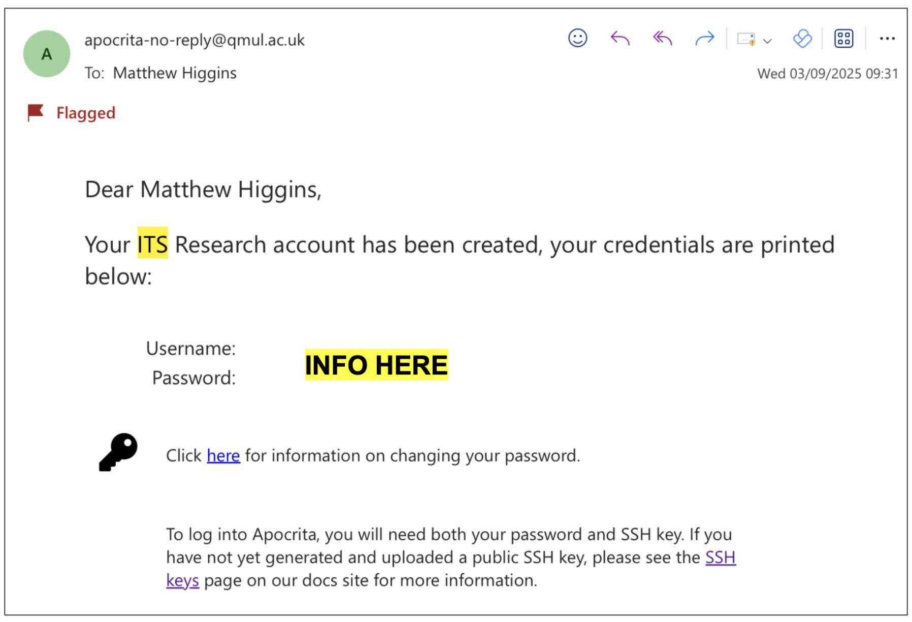

# **Accessing Apocrita**

---------------------------------------------

**Background Information:**

* Apocrita is the high performance computing cluster (HPC) here at QMUL.
* You will use Apocrita in Week 2 of this module and also for your coursework.
* Full details on Apocrita can be found [here](https://docs.hpc.qmul.ac.uk). 
* Before you can use Apocrita you need to request an account and that is the goal for this practical session! 

 
-----------------------------------------------------

### **UPDATE: Already Have Your SSH Key Pair, Connect to Apocrita Straight Away!** 

If you have already generated your SSH key pair, you can access Apocrita from your terminal using the command below. Make sure your **private key** file is saved on your own computer as this is needed to connect securely. Update `<YOUR_QMUL_USERNAME>` with your actual QMUL username (for example, `bgt726`):


```
ssh -i ~/.ssh/Apocrita_Key_<YOUR_QMUL_USERNAME> <YOUR_QMUL_USERNAME>@login.hpc.qmul.ac.uk
```

For example, if your usename is bgt726 it could be: 


```
ssh -i ~/.ssh/Apocrita_Key_bgt726 bgt726@login.hpc.qmul.ac.uk
```

This will connect you to Apocrita and upon first connecting your terminal will look like:


**Well done, you have successfully logged into Apocrita!** 

-----------------------------------------------------

# Please only follow the instructions below if you need to generate a new SSH Key Pair. 

-----------------------------------------------------

### **What is an SSH-Key Pair?**

To connect to Apocrita you will again be using SSH just like how you connected to your Virtual Machines (VMs). However, as Apocrita has a higher level of security you will need to use an SSH-Key Pair. 

An **SSH-Key Pair** consists of two cryptographic keys: a **public key** and a **private key**.

These keys are used to securely authenticate your identity when connecting to remote servers, such as Apocrita.

- The **public key** can be shared freely and is placed on the server you want to access.

- The **private key** is kept secure on your own computer and **should never be shared**.

When you attempt to connect to a server using SSH, the server checks if your public key matches your private key. If they match, you are granted access. This method is more secure than using passwords alone.

-----------------------------------------------------


### **Generating your SSH-Key Pair** 

Now its time to generate your own SSH-Key Pair! Complete the appropriate task **depending on your own operating system (Windows vs MacOS / Linux).**


!!! Task
    #### Mac & Linux Users 
    Use the command below to achieve this but please remember to replace `<YOUR_QMUL_USERNAME>` with your actual QMUL username e.g. `bty313`. 
    
    **The command below will prompt you if you want to add a passphrase for your key, please leave this blank and just press ENTER!** 


    ```
    # Template
    ssh-keygen -t rsa -b 4096 -f ~/.ssh/Apocrita_Key_<YOUR_STUDENT_ID>
    ```

    Example, if your QMUL username was *bty313*

    ```
    ssh-keygen -t rsa -b 4096 -f ~/.ssh/Apocrita_Key_bty313
    ```


!!! Task
    #### Windows Users 
    Use the command below in PowerShell to generate your SSH key pair. Remember to replace `<YOUR_QMUL_USERNAME>` with your actual QMUL username e.g.  `bty313`. 
    
    The command will prompt you if you want to add a passphrase for your key, please leave this blank and just press ENTER! 

    ```
    # Template
    ssh-keygen -t rsa -b 4096 -f "$env:USERPROFILE/.ssh/Apocrita_Key_<YOUR_QMUL_USERNAME>"
    ```

    Example, if your QMUL username was *bty313*

    ```
    ssh-keygen -t rsa -b 4096 -f "$env:USERPROFILE/.ssh/Apocrita_Key_bty313"
    ```

    Note: In Windows PowerShell, we use `$env:USERPROFILE\.ssh\` instead of `~/.ssh/` to specify the path to your SSH directory.

This command will generate two files in your standard SSH directory (`~/.ssh/`):

* `Apocrita_Key_<YOUR_STUDENT_ID>` — your **private key** (keep this secure and never share it).
* `Apocrita_Key_<YOUR_STUDENT_ID>.pub` — your **public key**.

Always keep your private key confidential. Only the public key (.pub) should be shared when requested.


------------------------------------------

## **Your Own Apocrita Account**

At the start of BIO726P, we sent a request to ITS Research Support to have an Apocrita account made for you.  
In the last few days you should have recieved an email, like below to confirm your account has been created, your username and password.



---------------------------------------------------

## **Adding Your Key To The Apocrita Account**


**1.** First to make life easier, transfer your public key to somewhere that you can easily access it! The tasks below copy it to your desktop. 

!!! Task
    For Mac & Linux:
    ```
    cp ~/.ssh/Apocrita_Key_<YOUR_QMUL_USERNAME>.pub ~/Desktop
    ```

    For Windows (in PowerShell):
    ```
    Copy-Item "$env:USERPROFILE/.ssh/Apocrita_Key_<YOUR_QMUL_USERNAME>.pub" "$env:USERPROFILE/Desktop"
    ```

**2.** Next head to the OnDemand Apocrita Website

!!! Task

    Head to [https://ondemand.hpc.qmul.ac.uk](https://ondemand.hpc.qmul.ac.uk)

    


**3.** Open up your files by clicking the button circled in red.

!!! Task

    


---------------------------------


**4.** Click the checkbox to show hidden files (as circled in red). This should make the hidden folders visible. Check to see if you already have an folder called `.ssh` as shown in blue.  **If you do not have this `.ssh` folder please make it by following step 4.5**.  

!!! Task

    

**4.5** *ONLY DO THIS STEP IF YOU DO NOT HAVE AN .SSH DIRECTORY.* Click the button to create a *New Directory* and then call the directory `.ssh`, make sure to **REMEMBER THE DOT** 

!!! Task

    


**5.** Enter the .ssh directory and click of the button to edit the *Authorized_Keys* file.  **If you do not have an *Authorized_Keys* file please create an empty file using the *New File* button and name it *Authorized_Keys***

!!! Task

    

**6.** On a new line, copy and paste the **contents** of your **PUBLIC KEY File** to modify the *Authorized_Keys* file. Once edited, make sure to save the changes made. To view the contents of your public key you can open it in any text editor or use the `cat` command via the terminal.

!!! Task

    


**7.** Now you have updated the *Authorized_Keys* file you can try and connect to Apocrita via SSH, similar to how you connect to your AWS virtual machines! To do this, open a new terminal / PowerShell on your computer.  

!!! Task 

    To connect to **Apocrita** via SSH you will need to use the following command:  `ssh -i ~/.ssh/Apocrita_Key_<YOUR_QMUL_USERNAME> <YOUR_QMUL_USERNAME>@login.hpc.qmul.ac.uk`

    * The `-i` parameter points to where you private key is found. 

    * Remember to update `<YOUR_QMUL_USERNAME>` with your actual QMUL username e.g. `bgt726` 

    * Make sure to use the **password provided in the original Apocrita email** sent from ITS Research Support (See Your Own Apocrita Account Above)

    


------------------------------------------
   
## **Cant Connect?**

* If you cannot login then please contact one of the demonstrators.

* If you have not recieved an email from ITS Research Support with your username and password please let me know. 

----------------------

If you’d like to learn more about Apocrita before the session with ITS on October 2nd, please check out these resources:

1. [Apocrita Home](https://docs.hpc.qmul.ac.uk)
2. [HPC Introduction](https://docs.hpc.qmul.ac.uk/intro/)
3. [Logging Into Apocrita](https://docs.hpc.qmul.ac.uk/intro/login/)


