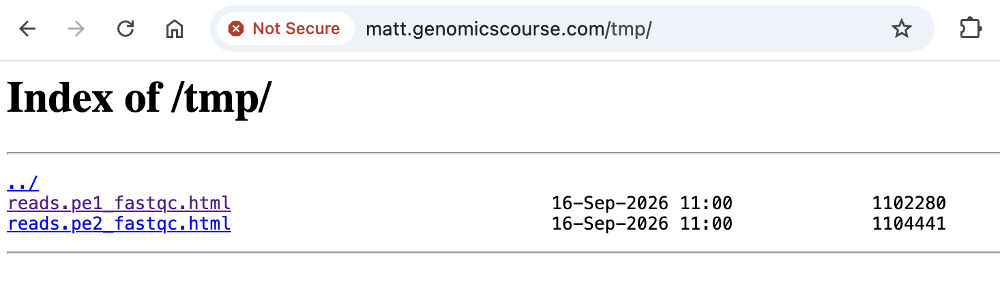
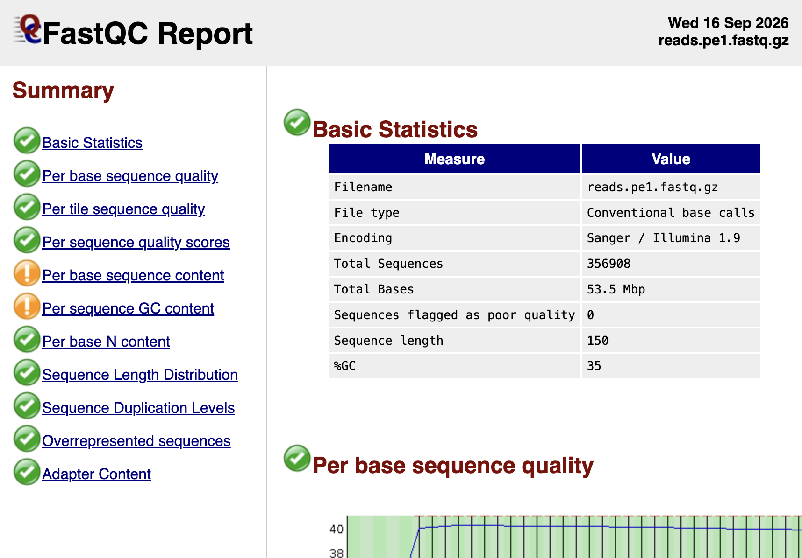
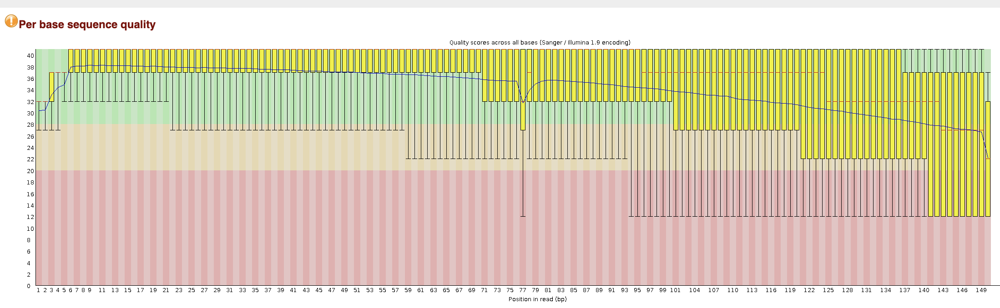
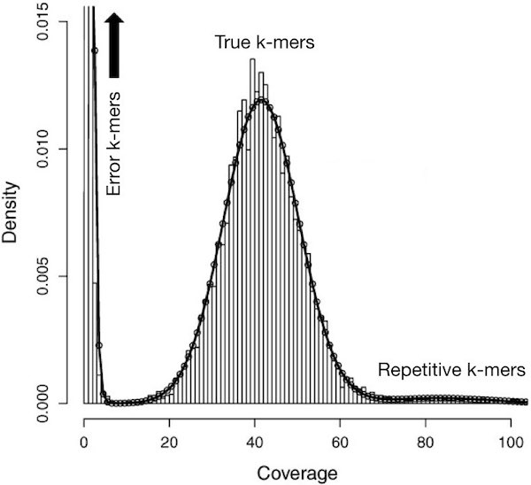

# **Part 1: Introduction To Genomic Data & Read Cleaning**

---------------------------------------------

## **1. Introduction**

[Cheap sequencing](https://www.genome.gov/sequencingcosts/) has created the opportunity to perform molecular-genetic analyses on almost anything! Traditional  model organisms including *C. elegans*, *S. cerevisiae* (Yeast) & *D. melanogaster* (Fruit Fly) to name a few, benefited from years of efforts by expert genome assemblers, gene predictors, and curators. They have created most of the prerequisites for genomic analyses.

In contrast, genomic resources are much more limited for those working on "emerging" model organisms or other species. These new organisms include most crops, animals and plant pest species, many pathogens, and major models for ecology & evolution.

The steps below are meant to provide some ideas that can help obtaining a **reference genome** and **geneset** of sufficient quality for many analyses. They are based on worked performed by the **Wurm Lab** who assembled the [fire ant genome](https://www.pnas.org/content/108/14/5679.long "The genome of the fire ant Solenopsis invicta") [1].


In this pratical, the dataset you will use represents **~0.5% of the fire ant genome**. This enables us to perform a toy/sandbox version of all analyses within a much shorter time than would normally be required. 

During this series of practicals, we will:

 1. Inspect and clean short (Illumina) reads,
 2. Perform genome assemble using our 'cleaned' data.  
 3. Assess the quality of our genome assembly. 
 4. Identify protein-coding genes within our assembly. 
 5. Assess the quality of gene predictions.
 6. Assess the quality of the entire process using a biologically meaningful measure.


-------------------

**Note**: *Please do not jump ahead. You will gain the most by following through each section of the practical one by one. If you're fast, dig deeper into particular aspects. Dozens of approaches and tools exist for each step - try to understand their tradeoffs.*

---------------------------
## **2. How to use this website!** 


As you move through sections chronologically you will see some parts which are labelled acrcording to its intended purpose below: 

#### General text

Text which does not have any special formatting and looks (plain) like this will guide you through the practicals, providing background and explaining what anlyses we are performing, and why.

#### Information and tips

!!! info
    Text which appears in boxes of this colour aims to inform you of important information. 


#### Task 

!!! task
    These boxes indicate there is something for you need to do! 
    


#### Code 

```
Text which appears in boxes of this colour will tell that you are looking at a terminal command.
You can copy and paste from here straight to the terminal but before you do take a moment to understand what the command is actually doing.
Several command lines may be present, with each new line representing a single command. 
```

Code windows are scrollable (horizontal & verticle)

#### Terminal output

!!! terminal "Terminal output"
    ```
    Text appearing in these boxes represents output you might expect to see in the terminal in response to a command.
    Check to see if you get a similar output!
    ```

Terminal windows are scrollable (horizontal & verticle)

#### Questions

!!! question
    Text in these boxes will usually ask an open ended question. If you cannot think of an answer or you want to check you have the right one, do not hesitate to ask one of the demonstrators for help! 

!!! Question

    === "Question"

        Text in these boxes will ask a specific question. To reveal the answer select the 'Answer' tab.

    === "Answer"

        Here you will find the answer! 

**Thats it!** You are now ready to progress with the pratical! If you have any questions don't hesitate to ask one of the demonstrators for help. Good luck! 

---------------------------

## **3. Software and environment setup**

### Test that the necessary bioinformatics software is available

!!! task
    In the terminal run `seqtk`. 


    The output of this command should look like this: 

    ```
    Usage:   seqtk <command> <arguments>
    Version: 1.5-r133

    Command: seq       common transformation of FASTA/Q
            size      report the number sequences and bases
            comp      get the nucleotide composition of FASTA/Q
            sample    subsample sequences
            subseq    extract subsequences from FASTA/Q
            fqchk     fastq QC (base/quality summary)
            mergepe   interleave two PE FASTA/Q files
            split     split one file into multiple smaller files
            trimfq    trim FASTQ using the Phred algorithm

            hety      regional heterozygosity
            gc        identify high- or low-GC regions
            mutfa     point mutate FASTA at specified positions
            mergefa   merge two FASTA/Q files
            famask    apply a X-coded FASTA to a source FASTA
            dropse    drop unpaired from interleaved PE FASTA/Q
            rename    rename sequence names
            randbase  choose a random base from hets
            cutN      cut sequence at long N
            gap       get the gap locations
            listhet   extract the position of each het
            hpc       homopolyer-compressed sequence
            telo      identify telomere repeats in asm or long reads

    ```

    If you obtained a similar output move onto the next section!

    However, if you terminal output produces an error (like below), please ask a demonstrator for help! 

    ```
        command not found
    ```


### **Set up directory hierarchy to work in**

Now we will start by creating a directory (folder) to work in! 

 Drawing on ideas from _[Noble (2009)](https://journals.plos.org/ploscompbiol/article?id=10.1371/journal.pcbi.1000424 "A Quick Guide to Organizing Computational Biology Projects")[2]_
and others, we recommend following a specific directory convention for all your
projects. The details of the convention that we will use in this practical can
be found
[here](https://github.com/wurmlab/templates/blob/master/project_structures.md "Typical multi-day project structure"). For the purpose of this practical we will use a slightly simplified version of this structure which is now explained below.


For each practical, you will have to create the following directory structure:

* A main directory in your home directory in the format
  (`YYYY-MM-DD-name_of_the_practical`, where `YYYY` is the current year, `MM` is
  the current month, and `DD` is the current day, and `name_of_the_practical`
  matches the practical). For instance, on the 22nd of September 2026, you should
  create the directory `2026-09-22-read_cleaning` for this practical.
* Inside this directory, create other three directories, called `input`, `tmp`,
  and `results`.
* The directory `input` will contain the FASTQ files.
* The directory `tmp` will represent your working directory.
* The directory `results` will contain a copy of the final results.


!!! task
    Now lets create the directory structure required for this practical!

    The command you will need is:
    ```
    mkdir 2026-09-22-read_cleaning
    ```

    Now, see if you can make the necessary **input**, **tmp** and **results** subdirectories on your own!


!!! info
    Each directory in which you have done something should include a `WHATIDID.txt` file in which you log your commands. 

    Being disciplined about structuring analyses is *extremely important*. It is similar to having a laboratory notebook. It will prevent you from becoming overwhelmed by having too many files, or not remembering what you did where.


!!! task
    To create our WHATIDID.txt file we can use the following command:

    ```
    touch ./2026-09-22-read_cleaning/WHATIDID.txt
    ```

    The to inspect the directory structure you have created you can run:

    ```
    tree ./2026-09-22-read_cleaning
    ```


The expected terminal output is highlighted below 
!!! terminal 
    ```
    2026-09-22-read_cleaning
    ├── input
    ├── tmp
    ├── results
    └── WHATIDID.txt
    ```


------------

## **4. Sequencing an appropriate sample**

**The properties of your data can affect the ability of bioinformatics algorithms to handle them.**
For instance, less diversity and complexity in a sample makes life easier:
assembly algorithms *really* struggle when given similar sequences. So less
heterozygosity and fewer repeats are easier.

Thus:

* A haploid is easier than a diploid  (those of us working on haplo-diploid
  Hymenoptera have it easy because male ants are haploid).
* It goes without saying that a diploid is easier than a tetraploid!
* An inbred line or strain is easier than a wild-type.
* A more compact genome (with less repetitive DNA) is easier than one full of
  repeats - sorry, grasshopper & tick researchers! ;)

Many considerations go into the appropriate experimental design and sequencing
strategy. We will not formally cover those here as this is a simple introduction and instead jump right into getting hands on with our data! 

----------

## **5. Illumina short-read cleaning**

In this practical, we will work with paired ends short read sequences from an Illumina machine. Each piece of DNA was thus sequenced once from the 5' and once from the 3' end. Thus, we expect to have two files per sequence.

However, sequencers aren't perfect. Several problems may affect the quality of
the reads. You can find some examples
[here](https://genomecuration.github.io/genometrain/a-experimental-design/curated-collection/Presentations/Sequencing%20Troubleshooting.pptx)
and [here](https://sequencing.qcfail.com/). 

Also, as you may already know,
"*garbage in – garbage out*", which means that reads should be cleaned before
performing any analysis.

------------

### **Setup and initial inspection using FastQC**

Lets move to the main directory for this practical, so that everything we need and do and create is in one place:

!!! task
    ```
    # Remember that yours may have a different date, now or in future, so be careful to check if you copy-paste code
    cd ~/2026-09-22-read_cleaning
    ```

    After, create a symbolic link (or symlink) using `ln -s` from the reads files to the
    `input` directory us the commands below:

    ```

    # Change directory to input
    cd input

    # Link the two compressed FASTQ files (remember that each correspond to one of
    # the pair)
    ln -s /shared/data/reads.pe1.fastq.gz .
    ln -s /shared/data/reads.pe2.fastq.gz .

    # Return to the main directory
    cd ..
    ```

    Now run the `tree` command to inspect your directory structure. 

The structure of your directory should look like this:

!!! terminal
    ```
    2026-09-22-read_cleaning
    ├── input
    │   ├── reads.pe1.fastq.gz -> /shared/data/reads.pe1.fastq.gz
    │   └── reads.pe2.fastq.gz -> /shared/data/reads.pe2.fastq.gz
    ├── tmp
    ├── results
    └── WHATIDID.txt
    ```

Now, you can start evaluating the quality of the reads `reads.pe1.fastq.gz` and
`reads.pe2.fastq.gz`. To do so, we will use
[*FastQC*](https://www.bioinformatics.babraham.ac.uk/projects/fastqc/)
([documentation](https://www.bioinformatics.babraham.ac.uk/projects/fastqc/Help/)). **FastQC** is a bioinformatics software tool to help visualise the characteristics of a sequencing run. It can thus inform your read cleaning a.k.a your quality control strategy.


!!! task
    Run FastQC on the `reads.pe1.fastq.gz` and `reads.pe2.fastq.gz` files.
    The command is given below, where instead of `YOUR_OUTDIR`, you will need
    replace `YOUR_OUTDIR` with the path to your `tmp` directory (e.g. if you main
    directory is `2026-09-22-read_cleaning`, you need to replace `YOUR_OUTDIR` with
    `tmp`):

    ```
    fastqc --nogroup --outdir YOUR_OUTDIR input/reads.pe1.fastq.gz
    fastqc --nogroup --outdir YOUR_OUTDIR input/reads.pe2.fastq.gz
    ```

    The `--nogroup` option ensures that bases are not grouped together in many of
    the plots generated by FastQC. This makes it easier to interpret the output in
    many cases. The `--outdir` option is there to help you clearly separate input
    and output files. To learn more about these options run `fastqc --help` in the
    terminal.

   
    **Important Note** - Remember to log the commands you used in the `WHATIDID.txt` file. To do this you can use the text editors introduced in the UNIX practical including `nano`

    Take a moment to verify your directory structure. You can do so using the `tree`
    command (be aware of your current working directory using the command `pwd`):

    ```
    tree ~/2026-09-22-read_cleaning
    ```

The resulting directory structure should look like this:

!!! terminal 
    ```
    2026-09-22-read_cleaning
    ├── input
    │   ├── reads.pe1.fastq.gz -> /shared/data/reads.pe1.fastq.gz
    │   └── reads.pe2.fastq.gz -> /shared/data/reads.pe2.fastq.gz
    ├── tmp
    │   ├── reads.pe1_fastqc.html
    │   ├── reads.pe1_fastqc.zip
    │   ├── reads.pe2_fastqc.html
    │   └── reads.pe2_fastqc.zip
    ├── results
    └── WHATIDID.txt
    ```

If your directory and file structure looks different, ask for some help!

------------

### **Inspecting FastQC Reports**

Now lets inspect those FastQC report generated!

!!! task

    First, copy the output html files to the directory ~/www/tmp directory.
    
    `cp tmp/*_fastqc.html ~/www/tmp/`

    Then, open the browser and go to your personal module page (e.g., if your QMUL username is `bob`,  the  URL will be `https://bob.genomicscourse.com`) and click on the `~/www/tmp` link.

    
    
    After you should be presented with a screen that allows you to select the following HTML files to visualise.
    
    
     
    Click the link to corresponding report files. You display should be similar to the image below. 

    


!!! Task
    **_Question:_**
    What does the *FastQC* report tell you? Take 10 minutes to look through the following FASTQC documentation [here](https://www.bioinformatics.babraham.ac.uk/projects/fastqc/Help/3%20Analysis%20Modules/) to understand the purpose of each plot. 

    If you are still confused about Phred Scores, check out this page [here](https://gatk.broadinstitute.org/hc/en-us/articles/360035531872-Phred-scaled-quality-scores)


!!! Question
     
    === "Question"

        Which FastQC plots shows the relationship between base quality and position in the sequence? What else does this plot tell you about nucleotide composition towards the end of the sequences?

    === "Answer"
        
        The **Per Base Sequence Quality** Plot 

        

        For each position a **Box-Whisker** type plot is drawn. The elements of the plot are as follows:

        The central red line is the median value
        The yellow box represents the inter-quartile range (25-75%)
        The upper and lower whiskers represent the 10% and 90% points
        The blue line represents the mean quality
        The y-axis on the graph shows the quality scores.


!!! Question
     
    === "Question"

        How does the quality change across the read? Is it uniform? 

    === "Answer"
        
        Typically the average nucleotide quality declines towards the end of the read, meaning that the sequencing quality is not uniform across the entire read. This reduction in quality towards the 3′ end is common in sequencing data and can be caused by factors such as signal degradation during the sequencing process.
    

!!! Question
     
    === "Question"
        
        Comparing the per-base sequencing quality reports for **reads.pe1.fastq.gz** and **reads.pe2.fastq.gz**, which set has, on average, higher quality? 

    === "Answer"
        
        - reads.pe1.fastq.gz 


!!! Question
     
    === "Question"

        How could you handle low quality reads? Discuss this question with a partner before looking at the answer. 

    === "Answer"
        
        - **Discard entire reads** that do not meet a specified quality threshold.
        - **Trim low-quality regions** from individual reads while retaining the higher-quality portions. 

        In the following sections, we will perform the following cleaning steps:


        * Trimming the ends of sequence reads using cutadapt.
        * K-mer filtering using the bioinformatics tool **kmc3**.
        * Removing sequences that are of low quality or too short using cutadapt.


Other similar tools include [*fastx_toolkit*](https://github.com/agordon/fastx_toolkit),
[*BBTools*](https://jgi.doe.gov/data-and-tools/bbtools/), and
[*Trimmomatic*](https://www.usadellab.org/cms/index.php?page=trimmomatic) however, we will not use them in this practical!

------------

### **Read trimming**

To clean the FASTQ sequences, we will use a software tool called
[*Trimmomatic*](http://www.usadellab.org/cms/?page=trimmomatic). As stated on the
official website: *Trimmomatic is a flexible read trimming tool for Illumina NGS data. It performs a variety of useful trimming tasks for Illumina paired-end and single ended data.*


To identify relevant quality cutoffs, it is necessary to be familiar with
[base quality scores](https://gatk.broadinstitute.org/hc/en-us/articles/360035531872-Phred-scaled-quality-scores) and examine the per-base quality score in your FastQC report.

We will run Trimmomatic with several options:
- `LEADING`: removes low quality bases from the beginning of the read
- `TRAILING`: removes low quality bases from the end of the read  
- `SLIDINGWINDOW`: performs a sliding window trimming approach
- `MINLEN`: removes reads that fall below the specified minimum length

!!! task
    Take 5 minutes to review the [**trimmomatic documentation here**]((http://www.usadellab.org/cms/?page=trimmomatic)) to make sure you understand completely how the tool works. This is best practice for bioinformaticians when using a new tool for the first time and a good habit! 


!!! task
    The command to run Trimmomatic on the paired-end reads files is reported below.  Trimmomatic processes both paired-end files simultaneously and produces four  output files: two for paired reads that survived trimming and two for unpaired 
    reads where only one of the pair survived.

    ```
    cd ~/2026-09-22-read_cleaning

    trimmomatic PE \
      input/reads.pe1.fastq.gz \
      input/reads.pe2.fastq.gz \
      tmp/reads.pe1.trimmed.fq \
      tmp/reads.pe1.unpaired.fq \
      tmp/reads.pe2.trimmed.fq \
      tmp/reads.pe2.unpaired.fq \
      LEADING:3 TRAILING:3 SLIDINGWINDOW:4:15 MINLEN:36
    ```
    
    **Note**: You can adjust the quality parameters (`LEADING`, `TRAILING`, and 
    `SLIDINGWINDOW`) based on your FastQC results.


!!! Info 
    **_Note:_**
    If you trim too much of your sequence (i.e., too large values for `LEADING`, 
    `TRAILING`, or too stringent `SLIDINGWINDOW` parameters), you increase the 
    likelihood of eliminating important information. For this example, we 
    suggest keeping quality thresholds around 3-5 for `LEADING` and `TRAILING`, and using a sliding window of 4:15 (window size:quality threshold).


!!! Question
     
    === "Question"
        
        When using Trimmomatic, does the order of trimming commands matter?


    === "Answer"
        
        **Yes.** Trimmomatic executes trimming steps sequentially from left to right in the exact order specified on the command line. The output of each step becomes the input for the next.

        Because commands run as a pipeline, the sequence directly impacts your output. For example it is best practice to: 

        - Run Quality Trimming in a logical sequence. Steps like `LEADING` or `TRAILING` remove low-quality bases from the read edges before `SLIDINGWINDOW` evaluates broader region quality.

        - The `SLIDINGWINDOW` will scan the read 5' to 3' and cut the left most position in the window where the average quality drops below the threshold, subsequently removing the rest of the read.
        
        - The Minimum length filter (MINLEN) is typically the final step. If placed earlier, reads are checked before subsequent quality trimming shortens them, allowing reads that end up below your minimum length threshold to slip into your final file.

        

-------------------

## 6. K-mer filtering, removal of short sequences

Let's suppose that you have sequenced your sample at 45x genome coverage. This
means that every nucleotide of the genome was sequenced 45 times on average.
So, for a genome of 100,000,000 nucleotides, you expect to have about 4,500,000,000
nucleotides of raw sequence. But that coverage will not be homogeneous. 
Instead, the real coverage distribution will be influenced by factors including DNA quality,  library preparation type, how was DNA packaged within the chromosomes (e.g., hetero vs. euchromatin) and local **GC** content. But you might expect most of the genome to be covered between 20 and 70x.

In practice, this distribution can be very strange. One way of rapidly examining
the coverage distribution before you have a reference genome is to chop your raw
sequence reads into short *"k-mers"* of *k* nucleotides long, and estimate the
frequency of occurrence of all k-mers. An example plot of k-mer frequencies from
a **haploid** sample sequenced at **~45x** coverage is shown below:



In the above plot, the *y* axis represents the proportion of k-mers in the
dataset that are observed *x* times (called *Coverage*). As, expected, we
observe a peak in the region close to 45, which corresponds to the targeted
coverage.

However, we also see that a large fraction of sequences have a very low
coverage (they are found only 10 times or less).

These rare k-mers are likely to be errors that appeared during library
preparation or sequencing, or **could be rare somatic mutations**. Analogously
(although not shown in the above plot) other k-mers may exist at very large
coverage (up to 10,000). These could be viruses or other pathogens, or highly 
repetitive parts of the genome, such as transposable elements or simple repeats.

!!! info
    **_Note_:** Extremely rare and extremely frequent sequences can both confuse assembly algorithms. Eliminating them can reduce subsequent memory, disk space and CPU requirements considerably, making overall computing more efficient and friendly.

Below, we use [*kmc3*](https://github.com/refresh-bio/KMC) to "mask" extremely
rare k-mers (i.e., convert each base in the sequences corresponding to rare
k-mers into **N**). In this way, we will ignore these bases (those called **N**)
because they are not really present in the species. Multiple alternative
approaches for k-mer filtering exist (e.g., using
[*khmer*](https://github.com/ged-lab/khmer)).

Here, we use *kmc3* to estimate the coverage of k-mers with a size of 21
nucleotides. When the masked k-mers are located at the end of the reads, we trim
them in a subsequent step using *cutadapt*. If the masked k-mers are in the
**middle** of the reads, we **leave them** just masked.
Trimming reads (either masked k-mers or low quality ends in the previous step)
can cause some reads to become too short to be informative. We remove such
reads in the same step using *cutadapt*. Finally, discarding reads (because they
are too short) can cause the corresponding read of the pair to become
**"unpaired"**. While it is possible to capture and use unpaired reads, we skip
that here for simplicity. Understanding the exact commands – which are a bit
convoluted – is unnecessary. However, it is important to understand the
concept of k-mer filtering and the reasoning behind each step.


!!! Task

    **Work through the following set of commands and before you run each one, try to understand what each step is doing!**

    To mask rare k-mers we will first build a k-mer database that includes counts for each k-mer. For this, we first make a list of files to input to KMC.

    ```
    ls tmp/reads.pe1.trimmed.fq tmp/reads.pe2.trimmed.fq > tmp/file_list_for_kmc
    ```

    Build a k-mer database using k-mer size of 21 nucleotides (-k). This will
    produce two files in your `tmp/` directory: `./tmp/21-mers.kmc_pre` and `./tmp/21-mers.kmc_suf`. The last argument (tmp) tells kmc where to put intermediate files during computation; these are automatically deleted afterwards. The -m option tells
    KMC to use only 4 GB of RAM.
    
    ```
    kmc -m4 -k21 @tmp/file_list_for_kmc tmp/21-mers tmp
    ```


!!! Question
     
    === "Question"
        
        As you were building the Kmer database a response was returned to the terminal, how did you interpret the output?

        ```
        ***************************************
        Stage 1: 100%
        Stage 2: 100%
        1st stage: 6.42227s
        2nd stage: 11.3654s
        Total    : 17.7877s
        Tmp size : 99MB

        Stats:
        No. of k-mers below min. threshold :      3595345
        No. of k-mers above max. threshold :            0
        No. of unique k-mers               :      7172390
        No. of unique counted k-mers       :      3577045
        Total no. of k-mers                :     80217049
        Total no. of reads                 :       674112
        Total no. of super-k-mers          :     12191773
        ```

    === "Answer"

        This output summarise the metrics, temporary resource usage, and k-mer count statistics produced by KMC (K-mer Counter) after processing the set of reads provided. 

        **Performance Metrics**

        - Stage 1 & Stage 2 (100%): KMC completed both of its operational phases. Stage 1 partitions sequencing reads into disk bins via super-k-mers, and Stage 2 counts and sorts k-mers within each bin.

        - 1st stage / 2nd stage / Total: Stage 1 took ~6.42s, Stage 2 took ~11.37s, for a total run time of 17.79 seconds.

        - Tmp size (99MB): Peak disk space used for temporary bin files during processing.

        **Dataset & K-mer Statistics**

        - Total no. of reads (674,112): Total number of sequencing reads read from the input files.
        - Total no. of k-mers (80,217,049): Cumulative count of all k-mers observed across all reads (includes all duplicates and repetitions).
        - Total no. of super-k-mers (12,191,773): Overlapping sequences of k-mers sharing identical signatures, generated during Stage 1 for efficient memory and disk management.
        - No. of unique k-mers (7,172,390): Total number of distinct k-mer sequences observed in the dataset before applying filters.
        - No. of k-mers below min. threshold (3,595,345): Distinct k-mers filtered out because their occurrence count fell below the minimum cutoff (-ci, usually set to 2 to eliminate sequencing errors).
        - No. of k-mers above max. threshold (0): Distinct k-mers filtered out for exceeding the maximum cutoff (-cx).
        - No. of unique counted k-mers (3,577,045): Distinct k-mers that passed all threshold filters and were written to the output database (7,172,390 - 3,595,345 = 3,577,045).
        


!!! Task

    Now the k-mer database is built it is time to continue! 

    Mask k-mers (-hm) observed less than two times (-ci) in the database
    (tmp/21-mers). The -t option tells KMC to run in single-threaded mode: this is
    required to preserve the order of the reads in the file. filter is a
    sub-command of kmc_tools that has options to mask, trim, or discard reads
    contain extremely rare k-mers.

    **Note**: kmc_tools command may take a few seconds to complete and does not
    provide any visual feedback during the process.

    ```
    kmc_tools -t1 filter -hm tmp/21-mers tmp/reads.pe1.trimmed.fq -ci2 tmp/reads.pe1.trimmed.norare.fq
    
    kmc_tools -t1 filter -hm tmp/21-mers tmp/reads.pe2.trimmed.fq -ci2 tmp/reads.pe2.trimmed.norare.fq
    ```

    Check if unpaired reads are present in the files
    
    ```
    cutadapt -o /dev/null -p /dev/null tmp/reads.pe1.trimmed.norare.fq tmp/reads.pe2.trimmed.norare.fq
    ```

    Trim 'N's from the ends of the reads, then discard reads shorter than 21 bp,
    and save remaining reads to the paths specified by -o and -p options.
    The -p option ensures that only paired reads are saved (an error is raised
    if unpaired reads are found).
    
    ```
    cutadapt --trim-n --minimum-length 21 -o tmp/reads.pe1.clean.fq -p tmp/reads.pe2.clean.fq tmp/reads.pe1.trimmed.norare.fq tmp/reads.pe2.trimmed.norare.fq
    ```

    Finally, we can copy over the cleaned reads to results directory for further analysis
    
    ```
    cp tmp/reads.pe1.clean.fq tmp/reads.pe2.clean.fq results
    ```

!!! Info

    **Note.** If you are interested in understanding how KMC3 works at a deeper level, take a look the [corresponding publication here](https://academic.oup.com/bioinformatics/article/33/17/2759/3796399), especially the supplementary information [here](https://oup.silverchair-cdn.com/oup/backfile/Content_public/Journal/bioinformatics/33/17/10.1093_bioinformatics_btx304/4/bioinformatics_33_17_2759_s2.pdf?Expires=1792590023&Signature=Uny9F0foIijNmtspDz9hiLfM3QfxxCU3x87dKARFq-VStn5JWO8xQ5FQkrrghK3XnBr8h30SdOy3GV7N7SpQb8mAhe0l8CQj7nPG3owC9vl-ory4VDxKN5CCkT~fcLeHXUuQHpTzJ6u87WeCJtAu-nFw45Bdo1fYh3Cv5FnwBU2~XfzaQHJoTlzB~VDhduy4G3fsQKSd0xxylBu18CYDeEvaXMMIrTUc5GrOd3tqMMgHcDjCGj4fqQMup46-vscjK2iygtlFcGs2xLesRby1KdDAl12P7TCuAwcYtaDL~nZDB9G~0nvPkAZEuALIfXH7iQf1VDepg9aJjpTWCnJbtg__&Key-Pair-Id=APKAIE5G5CRDK6RD3PGA)


-----------

### **Inspecting quality of cleaned reads**


!!! task    
    Now you have successfully performed read trimming, it is time to inspect the "cleaned" reads generated (**reads.pe1.clean.fq** & **reads.pe2.clean.fq**).To achieve this use the **FastQC** tool which you implemented earlier!  


!!! Question
    Comparing the FASTQC reports prior and post cleaning did you observe an improvment in the per-base nucleotide quality score and other metrics? 


-----------

### **Bonus Info (Optional)**


!!! Info    
    The use of **kmers** pops up across bioinformatics! Take a look at the tool [Sourmash (link here)](https://sourmash.readthedocs.io/en/latest/kmers-and-minhash.html) to see how kmers can be used in species identification! 


----------------------

## 7. References

1. Wurm, Y., Wang, J., Riba-Grognuz, O., Corona, M., Nygaard, S., Hunt, B.G.,
   Ingram, K.K., Falquet, L., Nipitwattanaphon, M., Gotzek, D. and Dijkstra,
   M.B., 2011. The genome of the fire ant Solenopsis invicta. *Proceedings of the 2012.
   National Academy of Sciences*, 108(14), pp.5679-5684.

2. Noble, W.S., 2009. A quick guide to organizing computational biology
   projects. *PLoS computational biology*, 5(7), p.e1000424.

## 8. Further reading

* MARTIN Marcel. Cutadapt removes adapter sequences from high-throughput
  sequencing reads. EMBnet.journal, [S.l.], v. 17, n. 1, p. pp. 10-12, may 2011.
  ISSN 2226-6089. doi: https://doi.org/10.14806/ej.17.1.200.

* Kokot, M., Długosz, M. and Deorowicz, S., 2017. KMC 3: counting and
  manipulating k-mer statistics. Bioinformatics, 33(17), pp.2759-2761.

## 9. Bonus questions if you're done early

!!! Question
      * Which read cleaners exist and are the most popular today? 
      * Which read cleaners would you use for Illumina data? Why?
      * Which read cleaners would you use for long-read data? Why?
      * Can having an existing genome assembly help with read cleaning? How?
