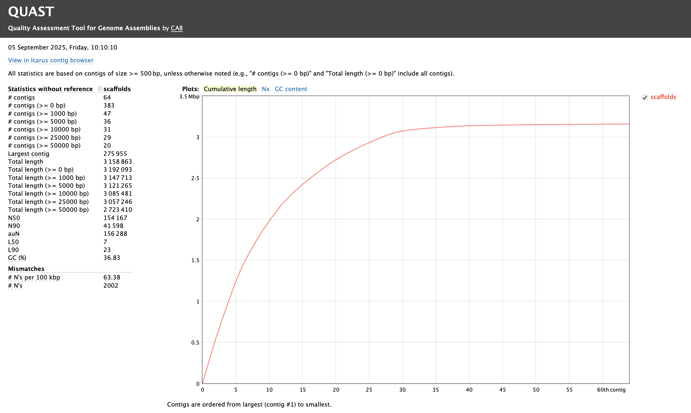

# **Part 2: Genome assembly**

-------------------------

You need to have gone through [Part 1: Read cleaning](pt-1-read-cleaning.md)
before starting this practical.

-------------------------

## **1. A brief assembly example**

Many different pieces of software exist for genome assembly but as mentioned in the earlier lectures we will be using [*SPAdes*](https://github.com/ablab/spades). 

Again for this practical you will be using the remote AWS computers created for you so please ssh back into these! 


!!! Task
      Following the same procedure from the first read cleaning practical
      [Part 1: Read cleaning](pt-1-read-cleaning.md), create a new main directory for today's practical (e.g., `2025-09-23-assembly`), the `input`, `tmp`, and `results` subdirectories, and the file `WHATIDID.txt` to log your commands. 

      To help get you started 
      ```
      mkdir 2025-09-23-assembly
      ```

Your directory hierarchy should look like the following

!!! terminal 
    ```
    2025-09-23-assembly
    ├── input
    ├── tmp
    ├── results
    └── WHATIDID.txt
    ```


Next lets link the cleaned reads from yesterdays practical into our `input` subdirectory. We will be using these clean reads to create our assembly today! 


!!! task
      Use the following commands to achieve this! 
      ```
      cd ~/2025-09-23-assembly
      cd input
      ln -s ~/2025-09-22-read_cleaning/results/reads.pe*.clean.fq .
      cd ..
      ```

!!! Question 
      * Did you note the use of `*` in the above command?
      * What does it do? (Hint: the symbol `*` is called a wildcard)

!!! task
      To assemble our cleaned reads with *SPAdes*, run the following line: 
      (_This will take about 10 minutes_)

      ```bash
      spades.py -o tmp -1 input/reads.pe1.clean.fq -2 input/reads.pe2.clean.fq
      ```

      Like any other assembler, *SPAdes* creates many files, including a 
      `scaffolds.fasta` file that is likely to be used for follow-up 
      analyses.  

      Copy this file to your `results` directory:

      ```bash
      cp tmp/scaffolds.fasta results/
      ```

      Take a look at the contents of this file (e.g., to see the first 10 lines, use 
      `head results/scaffolds.fasta`, or `tail results/scaffolds.fasta` to see the
      last 10 lines).

!!! Question
      Does it contain a lot of **NNNN** sequences? What do you think might be the reason for that? (Do not worry if your assembly does not contain any **NNNN** sequence.


!!! Task
      While waiting for Spades to run please see if you can find the additional *UNIX: command line learning material*, uploaded to QMPlus.


To get an idea of some challenges associated with **de novo genome assembly** and the approaches used to overcome them, please review the following papers:


* [Towards complete and error-free genome assemblies of all vertebrate species. (Rhie et al 2021)](https://www.nature.com/articles/s41586-021-03451-0)
* [Long walk to genomics: History and current approaches to genome sequencing and assembly. (Giani et al 2020)](https://www.sciencedirect.com/science/article/pii/S2001037019303277).
* [A hybrid approach for *de novo* human genome sequence assembly and phasing. Mostovoy et al (2016)](https://www.nature.com/articles/nmeth.3865).
* [Genetic variation and the *de novo* assembly of human genomes. Chaisson et al 2015 NRG](https://www.nature.com/articles/nrg3933)

-------------------------

## **2. Quality assessment**

*How do we know if our genome is good?*

> "... the performance of different *de novo* genome assembly algorithms can 
> vary greatly on the same dataset, although it has been repeatedly demonstrated
> that no single assembler is optimal in every possible quality metric 
> [6, 7, 8]. The most widely used metrics for evaluating an assembly include 1)
> contiguity statistics such as scaffold and contig N50 size, 2) accuracy
> statistics such as the number of structural errors found when compared with an
> available reference genome (GAGE (Genome Assembly Gold Standard Evaluation)
> evaluation tool [8]), 3) presence of core eukaryotic genes (CEGMA (Core 
> Eukaryotic Genes Mapping Approach) [9]) or, if available, transcript mapping
> rates, and 4) the concordance of the sequence with remapped paired-end and
> mate-pair reads (REAPR (Recognizing Errors in Assemblies using Paired Reads) 
> [10], assembly validation [11], or assembly likelihood [12])." -  [Wences & Schatz (2015)](http://genomebiology.biomedcentral.com/articles/10.1186/s13059-015-0764-4)

-------------

### **2.1 Simple metrics**

An assembly software will generally provide some statistics about what it did.
But, note that the output formats may differ between assemblers. 
[*Quast*](http://quast.sourceforge.net/quast),
the _Quality Assessment Tool for Genome Assemblies_ is a tool designed to
generate a standardized report.

!!! Task 
      Run *Quast* on the `scaffolds.fasta`
      file without special options to get the basic statistics:

      ```
      cd ~/2025-09-23-assembly/results
      quast.py scaffolds.fasta
      ```

      Have a look at the report (pdf or html) generated by *Quast* (copy the Quast's
      output directory to `~/www/tmp` and access through your browser).

      ```
      cp quast_results/latest/report.html ~/www/tmp
      ```


      

!!! Question
      * What do the values in the table mean?
      * For which values is higher better, and for which ones is smaller better?

In some cases, we have prior knowledge about the expected percentage of **GC** 
content, the number of chromosomes, and the total genome size. This information
can be compared to the statistics present in Quast's report.

!!! Task
      See if you can find the expected GC content of the complete Fire Ant genome? Does the GC content of the assembly match what is expected? 

------------------------------------------

### **2.2 Biologically meaningful measures**

Unfortunately, with many of the simple metrics, it is difficult to determine
whether the assembler did things correctly, or just haphazardly stuck lots of
reads together.

We often have other prior information about what to expect in this genome.
For example:

1. if we have a reference assembly from a not-too-distant relative, we can
    expect that large genome parts will be organised in the same order, i.e., 
    [_synteny_](https://en.wikipedia.org/wiki/Synteny).
2. If we independently created a transcriptome assembly, we can expect that
    the exons making each transcript will be mapped sequentially onto the 
    genome (see [TGNet](http://github.com/ksanao/TGNet) for an implementation).
3. We can expect different patterns of gene content and structure between
    eukaryotes and prokaryotes.
4. Pushing this idea further, we can expect a genome to contain a single copy
    of each of the "house-keeping" genes found in related species. This is 
    applied in *BUSCO* (Benchmarking Universal Single-Copy Orthologs).  
    Note that:
    * *BUSCO* is a refined, modernized implementation of [*CEGMA*](http://korflab.ucdavis.edu/Datasets/cegma/) 
      (Core Eukaryotic Genes Mapping Approach). *CEGMA* examines a eukaryotic
      genome assembly for the presence and completeness of 248 "core eukaryotic genes".
    * *Quast* also includes a "quick and dirty" method of finding genes.
5. We can expect that the different scaffolds in the genome have a unimodal
      distribution in sequence read coverage. Similarly, we can expect that the
      percentage of **GC** content will be unimodally distributed among scaffolds. Using this idea, the [Blobology](https://github.com/sujaikumar/assemblage) approach determined that evidence of foreign sequences in Tardigrades is largely due to extensive contamination rather than extensive horizontal gene transfer [Koutsovoulos et al 2016](http://www.pnas.org/content/113/18/5053).

**It is important to understand the concepts underlying these different 
approaches.**

------------------------------------------

## **3. In your own time**

Try to figure out what are the [tradeoffs between **de bruijn graph** and 
**overlap-layout-consensus** assembly approaches](https://www.nature.com/articles/nrg3367).
