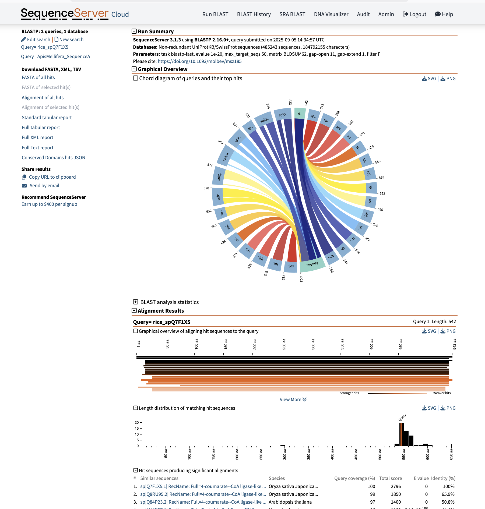
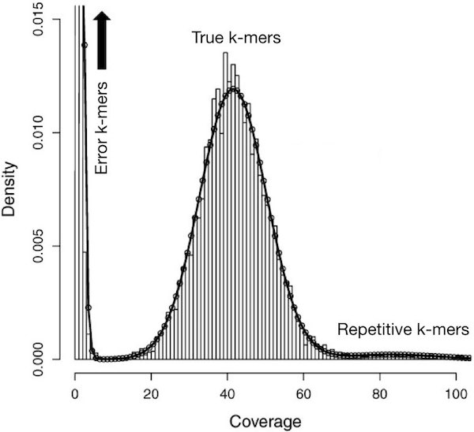

# **Part 3: Gene Prediction**

------------------------

You need to have gone through [Part 2: Genome assembly](pt-2-assembly.md)
before starting this practical.

------------------------

Many tools exist for gene prediction, some based on *ab initio* statistical
models of what a protein-coding gene should look like, others that use
similarity with protein-coding genes from other species, and others such as
[Augustus](http://bioinf.uni-greifswald.de/augustus/) and
[SNAP](https://github.com/KorfLab/SNAP), which use both.  

!!! Info
    There is no perfect tool or approach, thus we typically run many gene-finding tools and call a consensus between the different predicted gene models. 


Pipelines which combine the use of multiople tools include: 

* [MAKER](http://www.yandell-lab.org/software/maker.html), 
* [BRAKER](https://github.com/Gaius-Augustus/BRAKER) 
* [JAMg](https://github.com/genomecuration/JAMg)  

In this practical, we will use [**MAKER**]((http://www.yandell-lab.org/software/maker.html) and again for this practical you will be using the remote AWS computers created for you so please ssh back into these! 


----------------------------------

# 1. **Running Maker**

!!! Task
      Following the same procedure from the first read cleaning practical
      [Part 1: Read cleaning](pt-1-read-cleaning.md), create a new main directory for today's practical (e.g., `2025-09-24-gene_prediction`), the `input`, `tmp`, and `results` subdirectories, and the file `WHATIDID.txt` to log your commands. 

      To help get you started 
      ```
      mkdir 2025-09-24-gene_prediction
      ```


Your directory hierarchy should look like the following

!!! terminal 
    ```
    2025-09-24-gene_prediction
    ├── input
    ├── tmp
    ├── results
    └── WHATIDID.txt
    ```

Next lets link your assembled scaffolds from from yesterdays practical into our `input` subdirectory. We will be using MAKER to annotate this assembly! 

!!! Task
    Link the output (assembly) from Part 2 practical into `input` subdirectory:

    ```
    cd ~/2025-09-24-gene_prediction/input
    ln -s ~/2025-09-23-assembly/results/scaffolds.fasta .
    cd ..
    ```

    Next we are going to pull out the longest few scaffolds from our assembly and create a new file to house these.

    ```
    seqtk seq -L 10000 input/scaffolds.fasta > tmp/min10000.fa
    ```
    Gene prediction can be difficult if the assembly is low quality and does not include long scaffolds (remember, trash in = trash out). For instance, in the case of short scaffolds, if a gene is 2,000 bp long and includes introns, it may be very hard to find many entire genes. Thats why with the command above we are only carrying forward sequences that are longer than 10kb in length.   


!!! Info 
    **Note:** If you have difficulty in predicting the genes or you suspect that your assembly may be affected by the aforementioned issues, you can use already assembled scaffolds.
    ```bash
    # Link this scaffolds file into your input directory
    ln -s /shared/data/backup_assembly/scaffolds.fasta .
    ```

In the rest of this practical, we will show how to run MAKER in a simple scenario. For a better understanding of how this tool works, and how it can be applied in real-case scenarios,  we *strongly* encourage to read the paper and documentation. Also, checking which settings were used in recent publications can be very helpful for reproducing (or critiquing) analyses. 

!!! Info 
    Here is a link to the [**MAKER documentation**](http://www.yandell-lab.org/software/maker.html) 


!!! Question
    What bioinformatic tools is MAKER implementing in it genome annotation pipeline? 

!!! Task 
    Now change to your `tmp` directory and lets start the process of running the `maker` pipeline:

    ```
    cd tmp
    maker -OPTS
    ```
    This will generate an empty `maker_opts.ctl` configuration file (ignore the
    warnings). Edit that file using a text editor such as `nano` and
    specify:

    * genome: `min10000.fa`
    * deactivate RepeatMasker by changing `model_org` line to `model_org=` 
      (i.e., nothing afer `=`)
    * deactivate RepeatRunner by changing `repeat_protein` line to 
      `repeat_protein=` (i.e., nothing after `=`)
    * Augustus_species:`honeybee1` (remember to add 1 at the end; this provides
      hints to Augustus about the gene structure based on what we know about gene composition from the honeybee.

    We deactivated RepeatMakser and RepeatRunner due to computational limitations
    as well as the lack of a suitable library of repetitive elements for this
    species. For a real project, we *would* include RepeatMasker, likely after 
    creating a new repeat library for our species.  
    For a real project, we would also include gene expression data (RNAseq improves
    gene prediction performance *tremendously*), protein sequences from related
    species, and iteratively train gene prediction algorithms (e.g., Augustus and
    SNAP) for our data.

    After making the necessary edits we can inspect the `maker_opts.ctl` by printing it to stout using the following command, allowing us to double check the edits we have made are correct!

    ```
    cat maker_opts.ctl
    ```
    The expected terminal output is shown below.

!!! Terminal 
    ```
    #-----Genome (these are always required)
    genome=min10000.fa
    organism_type=eukaryotic #eukaryotic or prokaryotic. Default is eukaryotic

    #-----Re-annotation Using MAKER Derived GFF3
    maker_gff= #MAKER derived GFF3 file
    est_pass=0 #use ESTs in maker_gff: 1 = yes, 0 = no
    altest_pass=0 #use alternate organism ESTs in maker_gff: 1 = yes, 0 = no
    protein_pass=0 #use protein alignments in maker_gff: 1 = yes, 0 = no
    rm_pass=0 #use repeats in maker_gff: 1 = yes, 0 = no
    model_pass=0 #use gene models in maker_gff: 1 = yes, 0 = no
    pred_pass=0 #use ab-initio predictions in maker_gff: 1 = yes, 0 = no
    other_pass=0 #passthrough anyything else in maker_gff: 1 = yes, 0 = no

    #-----EST Evidence (for best results provide a file for at least one)
    est= #set of ESTs or assembled mRNA-seq in fasta format
    altest= #EST/cDNA sequence file in fasta format from an alternate organism
    est_gff= #aligned ESTs or mRNA-seq from an external GFF3 file
    altest_gff= #aligned ESTs from a closly relate species in GFF3 format

    #-----Protein Homology Evidence (for best results provide a file for at least one)
    protein=  #protein sequence file in fasta format (i.e. from mutiple organisms)
    protein_gff=  #aligned protein homology evidence from an external GFF3 file

    #-----Repeat Masking (leave values blank to skip repeat masking)
    model_org= 
    rmlib= #provide an organism specific repeat library in fasta format for RepeatMasker
    repeat_protein=
    rm_gff= #pre-identified repeat elements from an external GFF3 file
    prok_rm=0 #forces MAKER to repeatmask prokaryotes (no reason to change this), 1 = yes, 0 = no
    softmask=1 #use soft-masking rather than hard-masking in BLAST (i.e. seg and dust filtering)

    #-----Gene Prediction
    snaphmm= #SNAP HMM file
    gmhmm= #GeneMark HMM file
    augustus_species=honeybee1
    fgenesh_par_file= #FGENESH parameter file
    pred_gff= #ab-initio predictions from an external GFF3 file
    model_gff= #annotated gene models from an external GFF3 file (annotation pass-through)
    run_evm=0 #run EvidenceModeler, 1 = yes, 0 = no
    est2genome=0 #infer gene predictions directly from ESTs, 1 = yes, 0 = no
    protein2genome=0 #infer predictions from protein homology, 1 = yes, 0 = no
    trna=0 #find tRNAs with tRNAscan, 1 = yes, 0 = no
    snoscan_rrna= #rRNA file to have Snoscan find snoRNAs
    snoscan_meth= #-O-methylation site fileto have Snoscan find snoRNAs
    unmask=0 #also run ab-initio prediction programs on unmasked sequence, 1 = yes, 0 = no
    allow_overlap= #allowed gene overlap fraction (value from 0 to 1, blank for default)

    #-----Other Annotation Feature Types (features MAKER doesn't recognize)
    other_gff= #extra features to pass-through to final MAKER generated GFF3 file

    #-----External Application Behavior Options
    alt_peptide=C #amino acid used to replace non-standard amino acids in BLAST databases
    cpus=1 #max number of cpus to use in BLAST and RepeatMasker (not for MPI, leave 1 when using MPI)

    #-----MAKER Behavior Options
    max_dna_len=100000 #length for dividing up contigs into chunks (increases/decreases memory usage)
    min_contig=1 #skip genome contigs below this length (under 10kb are often useless)

    pred_flank=200 #flank for extending evidence clusters sent to gene predictors
    pred_stats=0 #report AED and QI statistics for all predictions as well as models
    AED_threshold=1 #Maximum Annotation Edit Distance allowed (bound by 0 and 1)
    min_protein=0 #require at least this many amino acids in predicted proteins
    alt_splice=0 #Take extra steps to try and find alternative splicing, 1 = yes, 0 = no
    always_complete=0 #extra steps to force start and stop codons, 1 = yes, 0 = no
    map_forward=0 #map names and attributes forward from old GFF3 genes, 1 = yes, 0 = no
    keep_preds=0 #Concordance threshold to add unsupported gene prediction (bound by 0 and 1)

    split_hit=10000 #length for the splitting of hits (expected max intron size for evidence alignments)
    min_intron=20 #minimum intron length (used for alignment polishing)
    single_exon=0 #consider single exon EST evidence when generating annotations, 1 = yes, 0 = no
    single_length=250 #min length required for single exon ESTs if 'single_exon is enabled'
    correct_est_fusion=0 #limits use of ESTs in annotation to avoid fusion genes

    tries=2 #number of times to try a contig if there is a failure for some reason
    clean_try=0 #remove all data from previous run before retrying, 1 = yes, 0 = no
    clean_up=0 #removes theVoid directory with individual analysis files, 1 = yes, 0 = no
    TMP= #specify a directory other than the system default temporary directory for temporary files
    ```


!!! Task 

    Now our configuration file is ready, run **MAKER**! 

    ```
    maker maker_opts.ctl
    ```
    This may take a few minutes, depending on how much data you gave it:

Genome annotation software like MAKER usually provide information about the 
exon-intron structure of the genes (e.g., in 
[GFF3 format](https://github.com/The-Sequence-Ontology/Specifications/blob/master/gff3.md)),
and sequence of corresponding messenger RNA and protein products (e.g., in
FASTA format).

!!! Task

    While **MAKER** is running, note the different file formats you have encountered throughout this module up until now.

!!! Question
    * What is the difference between a .fq.gz and .fq file?
    * What information does the 5th column in a GFF file contain?  


Once MAKER has finished running the results will be hidden in subdirectories of  `min10000.maker.output`. MAKER provides a helper script to collect this hidden outputs all in one place (again please ignore the warnings for these steps):

!!! Task 

    Run the following commands to pull out information about exon-intron structure of the predicted genes. This will be saved to the file min10000.all.gff.

    ```
    gff3_merge -d min10000.maker.output/min10000_master_datastore_index.log
    ```

    Next, pull out predicted messenger RNA and protein sequences. 
    ```
    fasta_merge -d min10000.maker.output/min10000_master_datastore_index.log
    ```

    These will be saved to the files: `min10000.all.maker.augustus.transcripts.fasta` and `min10000.all.maker.augustus.proteins.fasta`


------------------------------------

# **2. Quality control of individual genes**

So now we have some gene predictions... ***how can we know if they are any good?***

The easiest way to get a feel for this is to use the following example
sequences: [predicted protein sequences from rice and honeybee](../data/protein_prediction_example.fa).


We will compare them using BLAST to known sequences from other species against the Swissprot database (faster), or the Uniref50 database (slower).


## 2.1 Running BLAST with SequenceServer

We will use [SequenceServer](https://sequenceserver.com) to run the BLAST search!


!!! Task
    Open [genomicscourse.sequenceserver.com](https://genomicscourse.sequenceserver.com) in a new tab in your browser, paste the [example rice and honeybee protein sequences](../data/protein_prediction_example.fa) in the textbox.

    On the right hand side, under protein database select **Non-redundant UniProtKB/SwissProt sequences** as the database to use! 
    
    **The image below is what your browser window should look like!** 

    

  
    **Then click on the 'BLAST' button to begin the BLAST search. This will take a minute or two and the window will look like:** 

     

    
    **Once the analysis is complete you will get a output report like below:** 

    


    **This report contains a lot of information, but dont be overwhelmed!** Focus solely on the alignment section and you can toggle between alignments by selecting either the rice or honeybee sequencing in the top left hand side **(as highlighted in red below)**

    

    Now in you own time, examin the report and try to answer the questions below! 


!!! Question

    === "Question"

        What sequence is the *rice_spQ7F1X5* sequence most similar too?

    === "Answer"

         **sp|Q7F1X5.1|RecName: Full=4-coumarate--CoA ligase-like 5 [Oryza sativa Japonica Group]** with 100% query coverage and 100% identity. 


!!! Question

    === "Question"

        What sequence is *ApisMellifera_SequenceA* sequence most similar too?

    === "Answer"

         **sp|Q90ZA1.1| RecName: Full=Poly(A)-specific ribonuclease PARN; AltName: Full=Deadenylating nuclease; AltName: Full=Deadenylation nuclease; AltName: Full=Polyadenylate-specific ribonuclease; AltName: Full=parn-A [Xenopus laevis]** with 40% query coverage and 42.4% identity. 


!!! Question
    Look at the full report for the two given gene predictions, do you they are complete, or can you infer from the BLAST alignments that something may be wrong? Start by comparing the length of your gene prediction to that of the BLAST hits alongside other metrics such as identity.  


!!! Task
    Now try a few of your gene predictions. To do this you can use the predicted protein sequences which you generated and which can be found in `min10000.all.maker.augustus.proteins.fasta`. 
    
    **Note** - Run BLAST on only a maximum of 12 sequences at a time (instead of simply selecting the first 12 genes in your file, copy-paste sequences randomly from  the file). See if you can tell if based on the SequencingServer report generated the quality of the genome annotation!


As you can see, gene prediction software is imperfect. This is even the case when using all available evidence. This is potentially costly for analyses that rely on gene predictions, i.e. many of the analyses we might want to do:

> *“Incorrect annotations [ie. gene identifications] poison every experiment 
> that makes use of them. Worse still the poison spreads.”* – 
> [Yandell & Ence (2012)](http://www.ncbi.nlm.nih.gov/pubmed/22510764).

---

## **2.2 Using GeneValidator**

The
[*GeneValidator*](http://bioinformatics.oxfordjournals.org/content/32/10/1559.long)
tool can help to evaluate the quality of a gene prediction by comparing features
of a predicted gene to similar database sequences. This approach expects that
similar sequences should for example be of similar length. *Genevalidator* was
built to automate the comparison of sequence characteristics similarly to what we just did through visual individual BLAST results.

!!! Task 

    Try to run the [example rice and honeybee protein sequences](../data/protein_prediction_example.fa)
    through *GeneValidator*. It should be accessible at [https://genevalidator.genomicscourse.com/](https://genevalidator.genomicscourse.com/) or [https://genevalidator.wurmlab.com/](https://genevalidator.wurmlab.com/). 

    Copy and paste the xample rice and honey bee sequences into the input text box as shown in the image below. 

    

    ---------------
    
    **This make take a few minutes to complete, but on completion the results will appear in the section below. Take a look through the results page along with the original [GeneValidator publication (link here)](https://academic.oup.com/bioinformatics/article/32/10/1559/1742817?login=false) to inspect the proteins generated as part of the gene sequence.**

    -----------------

    


!!! Question

    === "Question"

        Why is it important to consider the **Length Cluster Metric**?

    === "Answer"

        When hovering over the metric we get the definition: *Check whether the prediction length fits most of the BLAST hit lengths, by 1D hierarchical clusterization.*

        So it is a way to see if the predicted gene length makes sense by comparing it to the lengths of BLAST matches. The method groups BLAST hit lengths into clusters, then reports:

        *  The predicted length of the query. 
        * The main length range where most BLAST hits fall.
        
        If the predicted length is inside that main range, it’s probably accurate.


!!! Task 

    **By selecting the image icon on the right hand side of each query (cirlced in red) you will open the drop down section to see the associated plots.** 

    

    **Now take a look at some of your protein predictions from your own MAKER genome annotation run! How do they look? Can you tell the difference between a good and a bad prediction?** 


!!! Question

    === "Question"

        What is the purpose of the **Gene Merge Validation Plot**?

    === "Answer"

        First lets break down the abbreviations used: 

         **What HSP means**

        * HSP (High-Scoring Pair) = a stretch of similarity found by BLAST between your query sequence and a database sequence.
        * Each HSP has:

            * A start coordinate (where the match begins on the query).
            * An end coordinate (where the match stops on the query).

        **What the graph shows**

        * X-axis (Start Offset): where the HSP begins on the query sequence (further right = later in the sequence).
        * Y-axis (End Offset): where the HSP ends on the query sequence (higher = later in the sequence).
        * Each red dot = one HSP, plotted by its start (x) and end (y) positions.

        **How to interpret this graph**

        * If all HSPs lined up diagonally in a single cluster, that would suggest they all map to one continuous region (a single gene).


------------------------

# **3. Comparing whole genesets and prioritizing genes for manual curation**

*Genevalidator*'s visual output can be handy when looking at a few genes. But the 
tool also provides tab-delimited output, useful when working in the command-line
or running the software on whole proteomes. This can help the analysis:

  * In situations when you can choose between multiple gene sets.
  * To identify which gene predictions are likely correct, and which predictions
    need might require further inspection and potentially be manually fixed.

------------------------

# **4. Manual curation**

Because automated gene predictions are not perfect, manual inspection and fixing
is often required. The most commonly used software for this is
[*Apollo/WebApollo*](https://genomearchitect.readthedocs.io/en/latest/).

We will not curate any gene models as part of this practical, but you can learn
about gene model curation through these YouTube videos:

1. [EMBL-ABR training 20171121 - Genome Annotation using Apollo](https://youtu.be/Wec7ZlXykQc)
2. [The i5k Workspace@NAL: a pan-Arthropoda genome database](https://youtu.be/HYo2RQa4BUI?t=865)


----------------------


<!---

This is the backup section just incase Sequence Server is not working.

## **2.1 Running BLAST**

To compare our obtain sequence against those which have already been described we can use BLAST (Basic Local Alignment Search Tool). As highlighted in the previous lecture series, this tool is common used by researches if they have a given sequence and they want to identify what other sequences are similar to it. 

The original BLAST paper can be found [here](ADD LINK) and this video provides a great overview for how the underlying algorithm works. 


!!! Task

    Now lets put this in action! First download the example protein sequences by [click on this link](../data/protein_prediction_example.fa)

    Inside this file you will find two predicted protein sequences:

    * rice_spQ7F1X5
    * ApisMellifera_SequenceA

    Now lets analyse these using BLAST. First lets go to the NCBI BLAST webpage ([https://blast.ncbi.nlm.nih.gov/Blast.cgi](https://blast.ncbi.nlm.nih.gov/Blast.cgi)).

    Select Protein BLAST 

    

    Then copy and paste our two sequences (rice_spQ7F1X5 & ApisMellifera_SequenceA) into the Query Box in the top left hand side of the screen. 


    

    To accelerate our analysis we are going to select to use the RefSeq_Protein database. This database is comprised only of proteins which are sourced from assembled that have been classified as high qaulity reference assembled. 

    

    This may take a couple minutes to run depending on how busy the server is at the time! On completion you should get a page as follows: 

     

    Use the box highlighted in the image below you can toggle between your query sequences and inspect the output alignments for each. 

    

    If you scroll down you can see the amino acid resolution alignment between the query sequence and the top sequences the tool identified with a high sequence similarity. 

    

    However, you can get 100s if not 1000s of BLAST hits from a given run and therefore it is useful to inspect this graphically. You can do this by selecting the option as shown in the image below. 

     
    
    Now you have your BLAST hits, try to answer the following question below: 


!!! Question
    What sequences does each protein align to best?  

!!! Question 
    How can we tell the length of the sequence which our query aligned too? 
     
!!! Question
    How would changing the word size in the advanced parameters section impact our analysis. 
     
!!! Question
    How does changing the database, say to the SwissProt database impact our analysis?

-->