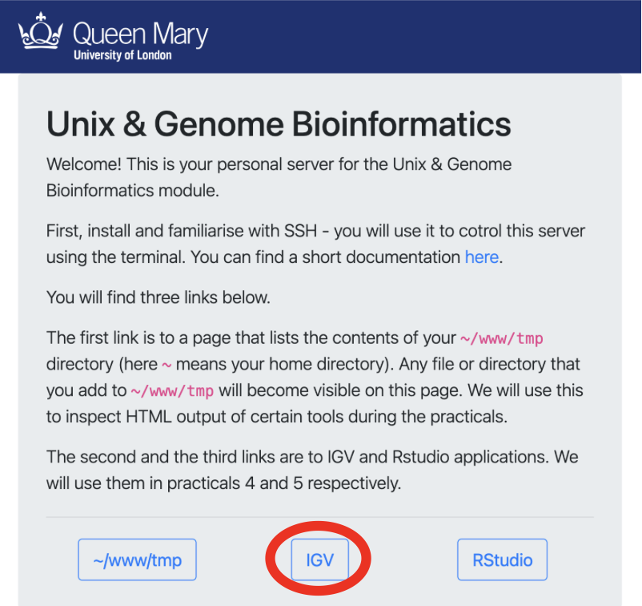
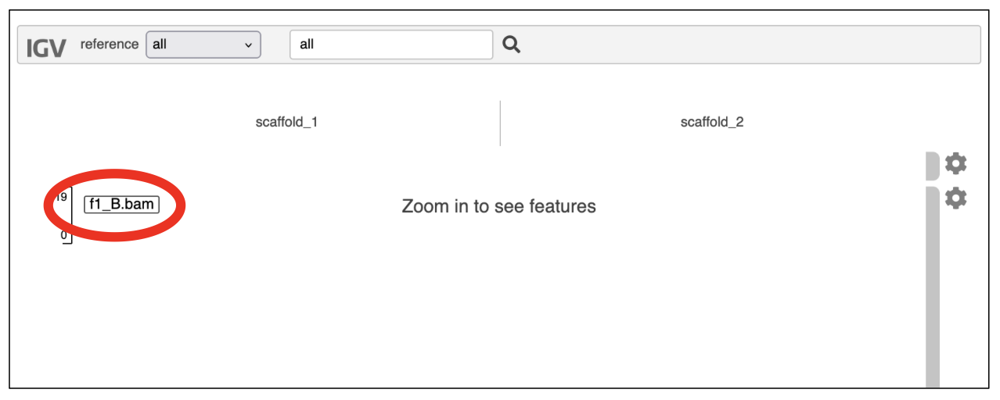
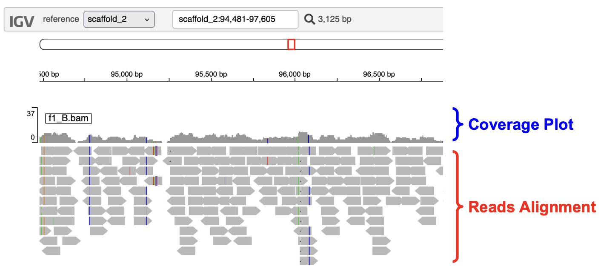
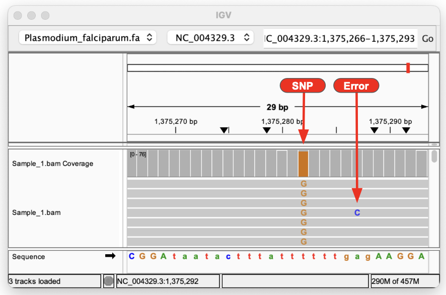
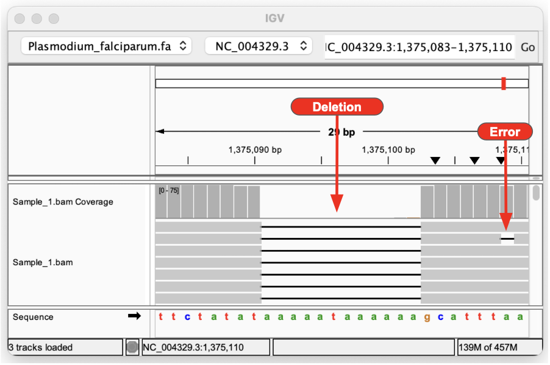
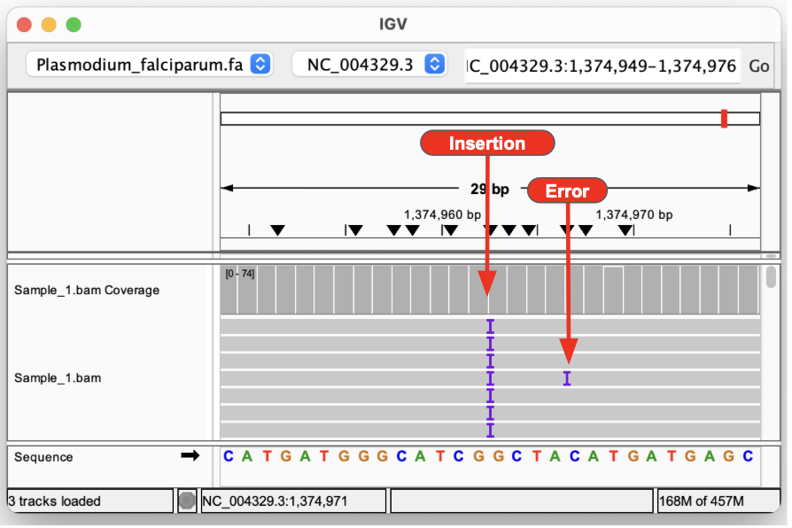

# Part 4: Read Mapping and Variant Calling

--------------------

## 1. Introduction

Different types of genetic variants exist. Commonly, people look at **single nucleotide polymorphisms** (**SNPs**, sometimes also known as **single nucleotide variants**, **SNVs**). Other classes include small insertions and deletions (known collectively as **indels**), as well as larger structural variants such as large insertions, deletions, inversions and translocations. Some of these larger ones are described as **copy number variants**, **CNVs**).

Here, we aim to identify genetic variation and genotypes from **short
paired-end Illumina reads**. First, we will map the reads from each
individual to a reference assembly similar to the one created in the
[previous practical](pt-2-assembly.md) (you can use your assembly too, but that is better left as an exercise for later!). Then we will find the positions where at least some of the individuals differ from the reference genome sequence (and from each other).

------------------

## 2. Pipeline

We will analyse subsets of whole-genome sequences of several fire ant
individuals. The fire ant, *Solenopsis invicta*, is notable for having two colony types, with some colonies having one queen and other
colonies having multiple queens. Previous work showed that this trait is
associated with the **B** vs. **b** alleles of a genetic marker. In this
practical, we aim to understand whether there are multiple genetic differences between B and b ants. As a reminder, all ants in single queen colonies carry the B allele of the genetic marker, while individuals carrying the b alelles exist exclusively in multiple queen colonies.

We will use a subset of the reads from whole-genome sequencing of 14 male fire ants. 

* Samples 1B to 7B are from **single-queen colonies.**
* Samples 1b to 7b are from **multiple-queen colonies.**


Ants are haplodiploid, which means that females are
diploid and males are haploid. Here we will use only males, so all our samples are haploid, which makes variant calling easier. 

**The aim of this practical is to genotype these 14 individuals. We will:**

1. Align the reads of each individual to a reference genome assembly using the
   aligner **bowtie2**.
2. Find positions that differ between each individual and the reference with
   the software **samtools** and **bcftools**.
3. Filter the SNP calls to produce a set of good-quality SNPs.
4. Visualise the alignments and the SNP calls in the genome browser **IGV**.

-----------------

## 3. Setting Up 

!!! Task
      Following the same procedure from the first read cleaning practical
      [Part 1: Read cleaning](pt-1-read-cleaning.md), create a new main directory for today's practical (e.g., `2025-09-29-mapping`), the `input`, `tmp`, and `results` subdirectories, and the file `WHATIDID.txt` to log your commands. 

      To help get you started 
      ```
      mkdir 2025-09-29-mapping
      ```

      Your directory hierarchy should look like the following

!!! terminal 
    ```
    2025-09-29-mapping
    ├── input
    ├── tmp
    ├── results
    └── WHATIDID.txt
    ```

!!! Task 
      Now create a symlink (using `ln -s`) from the reference genome `/shared/data/popgen/reference.fa` and the directory containing the reads `/shared/data/popgen/reads` to your `input` subdirectory:

      **_Note_**: Remember to keep a record of the commands you run in your `WHATIDID.txt` file.

      On Completion your directory hierarchy should look like the following

!!! terminal 
      ```
      2025-09-29-mapping/
      ├── input
      │   ├── reads -> /shared/data/popgen/reads
      │   └── reference.fa -> /shared/data/popgen/reference.fa
      ├── results
      ├── tmp
      └── WHATIDID.txt
      ```

!!! Task 
      To check that the reference genome and the reads directory are linked
      (not copied) in the `input` directory, you could use one of the following
      commands from your `input` directory:

      ```bash
      ls -al
      ```

      Now check how many scaffolds there are in the reference genome:

      ```
      grep "^>" input/reference.fa
      ```

!!! Question
      Have a look at the fastq files (`ls input/reads`).

      * Why does each sample have two sets of reads?
      * How many reads do we have in individual *f1_B*? (you can use `zless` and `wc -l`)
      * How long are the reads?
      * Knowing that each scaffold is 200kb, calculate which coverage you would expect per base pair of individual *f1_B*?

## 4. Aligning reads to a reference assembly

The first step in our pipeline is to align the paired end reads to the reference genome. We are using the software [*bowtie2*](http://bowtie-bio.sourceforge.net/bowtie2/index.shtml),
which was created to align short read sequences to long sequences such as the scaffolds in a reference assembly. Like most aligners, *bowtie2* works in two steps:

1. The scaffold sequence (sometimes known as the database) is indexed, in this case using the [Burrows-Wheeler Transform](https://en.wikipedia.org/wiki/Burrows-Wheeler_transform). This manner of representing the genome enables it to be stored using less memory, and thus enables memory-efficient alignment of sequence reads to the reference.

2. Only subsequently will we do the actual alignment of Illumina reads from individual samples to the indexed reference genome.


!!! Task
      Let's start by linking scaffold sequences to our `tmp` directory.

      Symlink `reference.fa` to `tmp/`:

      ```
      cd tmp
      ln -s ~/2025-09-29-mapping/input/reference.fa .
      cd ..
      ```

      Build the index (step 1):

      ```
      bowtie2-build tmp/reference.fa tmp/reference
      ```

      Perform the alignment (step 2):

      ```
      # Create a directory for the alignments.
      mkdir tmp/alignments

      # Use bowtie2 to align paired reads from f1_B sample to the reference.
      bowtie2 --local -x tmp/reference -1 input/reads/f1_B.1.fq.gz -2 input/reads/f1_B.2.fq.gz > tmp/alignments/f1_B.sam
      ```


!!! Question
     
    === "Question"

        * What is the meaning of the `-1` and `-2` parameters?
        * Why do we use `--local` parameter?


    === "Answer"
        
        * To specify the paths to the fastq files containing the first mates (forward reads) and second mates (reverse reads) of the raw paired-end illumina sequencing data.
        * To specify to run a local alignment vs end-to-end. Pull up the BowTie2 documentation for more information.


The command produced a *SAM* file ([Sequence Alignment/Map file](http://samtools.github.io/hts-specs/SAMv1.pdf)), which is a text representation of the standard format used to store sequence alignments. Have a quick look at the file using `less`. The file includes a header (lines starting with the `@` symbol), and a line for every read aligned to the
reference assembly. For each read, we are given a mapping quality value, the position of both reads in a pair, the actual sequence and its quality by base pair, and a series of flags with additional measures of mapping quality.

!!! Question
      Can you tell, by looking at the *SAM* file specification linked above, which columns correspond to which information?

We now need to run **bowtie2** for all the other samples. We could do this by typing the same command another 13 times (changing the sample name). Alternatively, we can use [*GNU parallel*](https://www.gnu.org/software/parallel/), a tool that helps to automate running the same command on several samples.


!!! Task

      To use `parallel`, lets first create a file that contains all sample names:

      ```
      ls input/reads/*fq.gz | cut -d '/' -f 3 | cut -d '.' -f 1 | sort | uniq > tmp/names.txt
      ```

      Lets break this command down to understand what is going on:

      * `ls input/reads/*fq.gz`: Lists the paths of all files in input/reads/ that end with fq.gz`
      * `cut -d '/' -f 3` : Split the path using `/` as the deliminator and take the 3rd element (aka just the file name).
      * `cut -d '.' -f 1` : Split the output using `.` as the deliminator and take 1st elemnt (sample name )
      * `sort` sort the resulting list alphabetically 
      * `uniq` remove duplicate lines in the out (aka only 1 entry per sample).


      Then, run **bowtie2** on each sample, this will take a few minutes:

      ```
      cat tmp/names.txt | parallel --verbose --jobs 1 "bowtie2 --local -x tmp/reference -1 input/reads/{}.1.fq.gz -2 input/reads/{}.2.fq.gz > tmp/alignments/{}.sam"
      ```

Because the *SAM* files include a lot of information, they tend to occupy a lot of space (even with our small example data). Therefore, *SAM* files are generally compressed into *BAM* files (Binary sAM). Most tools that use aligned reads require BAM files that have been sorted and indexed by genomic position. This is done using [*samtools*](http://www.htslib.org/doc/samtools.html), a set of tools created to manipulate *SAM*/*BAM* files.


!!! Task

      First, sort the SAM file by scaffold position and output in BAM format:

      ```
      samtools sort -O BAM tmp/alignments/f1_B.sam > tmp/alignments/f1_B.bam
      ```

!!! Info
      You may get the warning below: 

      ```
      samtools: /usr/local/miniconda/bin/../lib/libtinfow.so.6: no version information available (required by samtools)
      samtools: /usr/local/miniconda/bin/../lib/libncursesw.so.6: no version information available (required by samtools)
      ```
      Please ignore this message as the command has still run successfully!


!!! Task
      Then, index the BAM file generated above (creates f1_B.bam.bai):

      ```
      samtools index tmp/alignments/f1_B.bam
      ```

      Also in this case, we can use `parallel` to run this step for all the samples:

      ```
      # For each sample, sort the SAM file for each and convert to BAM.
      cat tmp/names.txt | parallel --verbose "samtools sort -O BAM tmp/alignments/{}.sam > tmp/alignments/{}.bam"

      # Index the BAM file for each sample.
      cat tmp/names.txt | parallel --verbose "samtools index tmp/alignments/{}.bam"
      ```

      Now check that a `.bam` and a `.bai` file exists for each sample.

      To view what's in a *BAM* file, you have to use `samtools view`:

      ```
      # View the entire BAM file:
      samtools view tmp/alignments/f1_B.bam | less -S

      # View a particular region of the reference:
      samtools view tmp/alignments/f1_B.bam scaffold_1:10000-10500 | less -S
      ```

      Copy the `.bam` and `.bai` files to the `results` directory.

      ```
      cp tmp/alignments/*.bam results/
      cp tmp/alignments/*.bai results/
      ```

      Once you are sure the files are in `results`, clean the `tmp` directory. **ONLY DO THIS ONCE YOU ARE CERTAIN YOU HAVE COPIED YOUR BAM FILES TO THE RESULTS DIRECTORY**

      ```
      rm -ri tmp
      ```

!!! Task

      Samtools is an essential toolkit used by thousands of bioinformaticians every day. In addition to converting SAM files to BAM format, it provides options to generate summary statistics about your alignments, such as the number of mapped reads, alignment depth, and coverage. 

      Explore the available options by running:

      ```
      samtools --help
      ```

      Identify which commands provide summary statistics (simple stats), along with alignment and coverage statistics and  use them to assess some of your BAM files!


-----------------------------------------------------

## 5. Variant calling

!!! Task
      Create a new directory in your `home` for the second part of today's practical (e.g., `2025-09-29-genotyping`). You will want to set up the relevant subdirectories  and `WHATIDID.txt` file, as you have done before. Then symlink (`ln -s`) the reference genome `/shared/data/popgen/reference.fa` and the alignments from the mapping part of the practical (both `.bam` and `.bai` files) to your input` directory.

      To help get you started 
      ```
      mkdir 2025-09-29-genotyping
      ```

      Your directory hierarchy should look like the following when running `tree`

!!! terminal 
   ```
   2025-09-29-genotyping/
   ├── input
   │   ├── -> /shared/data/popgen/reference.fa
   │   ├── -> ~/2025-09-29-mapping/results/f1_B.bam
   │   ├── -> ~/2025-09-29-mapping/results/f1_B.bam.bai
   │   └── -> ...
   ├── results
   ├── tmp
   └── WHATIDID.txt
   ```

!!! Info
      **_Note:_** When you create links from one directory to another, it is better to use the absolute path for links like `~/2025-09-29-mapping/results/*.bam*` instead of `../../2025-09-29-mapping/results/*.bam`


Several variant calling approaches exist. The simplest approach is to look for positions where the mapped reads consistently have a different base than the reference assembly (this is called **consensus approach**). For this, we will use [*bcftools*](http://www.htslib.org/doc/bcftools.html), a set of tools to call variants and manipulate them. We will run two commands:

```
bcftools mpileup
```

The previous command looks for inconsistencies between the reference and the aligned reads, followed by:

```
bcftools call
```

which interprets them as variants.

We will use *multiallelic caller* (option `-m`) of `bcftools` and set all
individuals as **haploid**.

!!! Task

      First link `reference.fa` to `tmp/`

      ```
      cd tmp
      ln -s ~/2025-09-29-genotyping/input/reference.fa .
      cd ..
      ```

      Then create the index of the reference (different from that used by *bowtie2*):

      ```
      samtools faidx tmp/reference.fa
      ```

      Finally, call the variants using *bcftools*: identify all differences between
      reference and reads using `mpileup` subcommand and pipe it to call subcommand
      to determine if the identified difference are variants.

      ```
      bcftools mpileup --output-type u --fasta-ref tmp/reference.fa input/*.bam | bcftools call --ploidy 1 --variants-only --multiallelic-caller > tmp/calls.vcf
      ```

      The output `calls.vcf` is a file in the *VCF* ([Variant Call Format](http://samtools.github.io/hts-specs/VCFv4.3.pdf)) format, which contains the position, nature and quality of the called variants.

!!! Question
     
    === "Question"

        * Why we are using the `--variants-only` option in `bcftools call`?

    === "Answer"
        * To output variant sites only in the VCF file. So position in the reference genome where no variants were found will be excluded. 


!!! Task
      Check that the output VCF file has the right extension `.vcf`:

      ```
      ls tmp/calls*
      ```

      If the listed file has a different name from the expected `calls.vcf`, rename it by running the command:

      ```
      mv tmp/YOUR_CALLS_FILENAME tmp/calls.vcf
      ```

      Where you need to substitute YOUR_CALLS_FILENAME with the filename you got from the `ls tmp/calls*` command.

      Now Let's look at the *VCF* file produced by typing `less -S tmp/calls.vcf`. The file is composed of a header and rows for all the variant positions.  Look at the different columns and check what each is (the header includes labels). Notice that some columns include several fields.

!!! Question
      * Where does the header start and end?
      * How is the genotype of each sample coded?
      * How many variants were identified?
      * Can you tell the difference between SNPs and indels? How many of each have been identified?
      * *(Hint: Use the bcftools stats option)*

-----------------------------------------------------------------

## 6. Quality filtering of variant calls

Some potentially identified genetic variations may be unreliable - for example, due to sequencing errors or ambiguous mapping. The VCF file includes several fields with quality information that enable us to remove lower-confidence genetic variants. The most obvious is the column QUAL, which provides a [Phred-scale quality score](https://en.wikipedia.org/wiki/Phred_quality_score) for each genetic variant.


!!! Question
      * What does a Phred-scale quality score of 30 mean?

We will filter the VCF using `bcftools filter`. Based on the distribution of quality values we see in the file, we suggest removing variants with a quality less than **30**:


!!! Task 

      Remove variant sites with a quality score under 30. Then remove sites that have a missing genotype call.
      ```
      bcftools filter --exclude 'QUAL < 30' tmp/calls.vcf | bcftools view --genotype ^miss > tmp/filtered_calls.vcf
      ```

      In real scenarios, it may be important to filter by other parameters, but we will also use a different variant calling & genotyping approach. bcftools is not normally used for real projects.


**In the downstream analysis, we only want to look at sites that are:**

1. snps (--types snps)
2. biallelic (--min-alleles 2 --max-alleles 2)
3. where the minor allele is present in at least one individual (because we are
   not interested in the sites where all individuals are different from the
   reference, yet equal to each other)


!!! Task

      Now filter your data again based on this criteria by selecting **biallelic** variant sites that are SNPs and at least one individual differs from the rest:

      ```
      bcftools view --types snps --min-alleles 2 --max-alleles 2 --min-ac 1:minor tmp/filtered_calls.vcf > tmp/snp.vcf
      ```

      (Always check that the output file in `tmp` has the right extension `.vcf`)


!!! Question
      * How many SNPs does the resulting *VCF* file have?
      * Can you find any other parameters indicating the quality of the site?
      * Can you find any other parameters indicating the quality of the variant call for a given individual on a given site?

In this practical, we only looked at a subset of the fire ant genome. When calling variants for the entire genome and using hundreds or thousands of samples, the resulting VCF files can be very large (reaching terabytes for cancer genomics projects!). It is thus a good idea to compress and index a *VCF* file. This is typically done using `bgzip` (for compression) and `tabix` (for indexing - tabix requires the file to be compressed using `bgzip`).


!!! Task
      Compress the VCF file using `bgzip`. This will remove the `snp.vcf` file and produce `snp.vcf.gz` file in its place:

      ```
      bgzip tmp/snp.vcf
      ```

      Index the compressed *VCF* file. This will produce a `.tbi` file alongside the `snp.vcf.gz` file.

      ```
      tabix tmp/snp.vcf.gz
      ```

      Now that we have a SNP set, we can copy it to `results` directory:

      ```
      cp tmp/snp.vcf.gz results
      cp tmp/snp.vcf.gz.tbi results
      ```

---------------------------------------------------------

## 7. Viewing the results using IGV (Integrative Genome Viewer)

In this part of the practical, we will use the software [*IGV*](https://igv.org) to visualise the alignments and the SNPs we generated, and verify some of the called SNPs.

!!! Task
      1. Copy the *BAM* and their index files (`.bai`) to `~/www/igv/data`.
      2. Copy the `snp.vcf.gz` and its index file (`.tbi`) to `~/www/igv/data`.

      To visualise them, open *IGV* by clicking on the *IGV* link in your personal module page (e.g., http://bob.genomicscourse.com).

      


      Upon loading your webpage should look like below, with the option to zoom in to see feature! By scrolling down, you can see all the bam files are loaded and named on the left hand side, as circled in red. 
      
      
      
      
      

      If you scroll to the bottom of the web-page you will also see your VCF file!
      
      Now lets zoom in to begin to see our aligned reads. For each BAM file we see two plots, the top being the coverage at each position and the bottom highlighting the individual aligned reads which are shown in grey. 

      

      When you observe colour in the IGV plot, this typically indicates that there is a difference between the read sequence and the underlying refrence sequence. This could be due to the presence of a genetic variant or possibly due sequencing error!  To help you tell the difference please consider the plots below which highlight how **SNPs**, **Insertions** and **Deletions** are represented in IGV 
      
      **_Note_** - *these are from a different practical, however the colouration remains the same regarding how IGV highlights potential genetic variants*.
      

      

      

      


!!! Task
      * Using the search box at the top of the IGV webpage go to the follow position **scaffold_2:95,983-96,079** and see what variants you can see in the f1_B.bam sample! *(You should observe a SNP and Deletion)*


      * Using the search box at the top of the IGV webpage go to the follow position **scaffold_2:97,597-97,636** and see what variants you can see in the f1_B.bam sample! *(You should observe an Insertion)*


Here, we use [*igv.js*](https://github.com/igvteam/igv.js#igvjs) which is
designed to be embedded in web pages and the installation is pre-configured to use the assembly (`reference.fa` file) you used for variant calling.


!!! Question
      * Can you identify genetic variants and sequencing errors?
      * Has bcftools/mpileup recovered the same genetic variants as **indicated in the snps.vcf.gz,** as you would expect given the IGV visualisation?
      * Do you think our filtering was effective?


## 8. Refining your skills 

!!! Task

      Well done if you have made it this far! 
      
      To further develop your skills, repeat the mapping and variant calling process for a few samples using your own reference assembly created during the *Week 1, Wednesday, Assembly Practical Session*. This exercise will help you gain confidence in independently running the mapping and variant calling pipeline, and give you more practice with tools like samtools and bcftools. 

