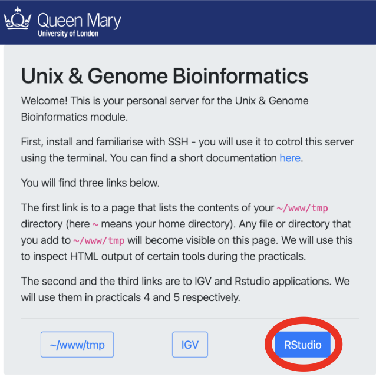
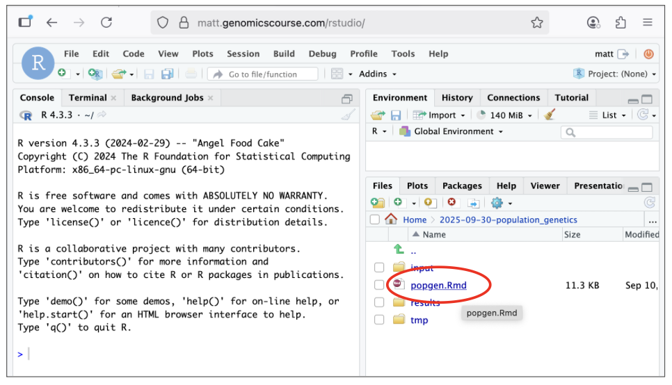
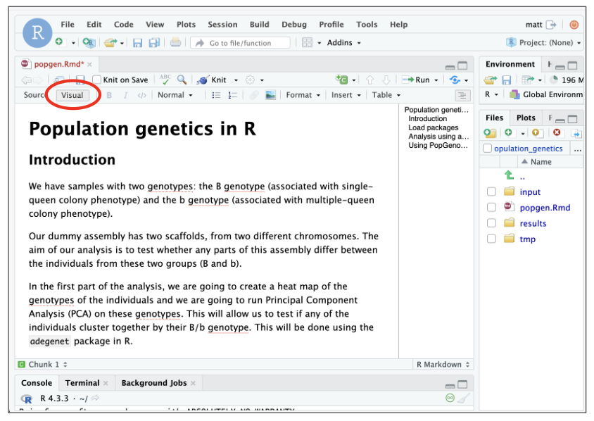
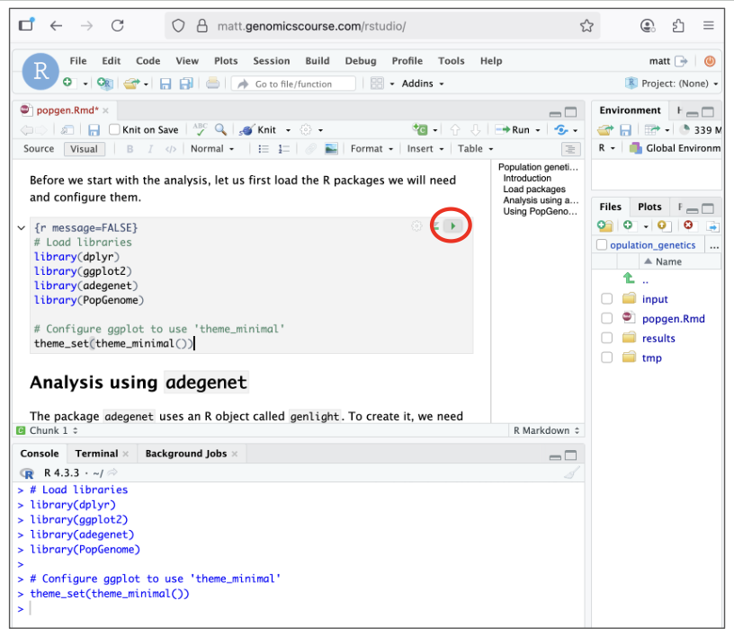

# **Part 5 - Population genetics in R**

----------------------------------------------------------------------------

## **1. Introduction**

In this practical, we will use samples with two genotypes associated to two 
distinct phenotypes. Also, our example assembly consists of two scaffolds, 
from two different chromosomes:

| Genotype label |  Phenotype description  |
| :------------: | :---------------------: |
|      *B*       |  *single-queen* colony  |
|      *b*       | *multiple-queen* colony |


The aim of our analysis is to test whether any parts of this assembly differ 
between the individuals from these two groups (*B* and *b*).

In the first part of the analysis, we are going to create a heat map of the 
genotypes of the individuals and we are going to run Principal Component 
Analysis (PCA) on these genotypes. This will allow us to test if any of the 
individuals cluster together by their B/b genotype. This will be done using 
the *adegenet* package in R.

In the second part, we are going to estimate the genetic differentiation between
the two groups (*B* and *b*). We will do this analysis over a sliding window,
to see if the differentiation between *B* and *b* are specific to any portion of
the genome. We will also measure the genetic diversity among each of the groups,
which may tell us something about the evolutionary history of the portions of
genome represented in our assembly. This will be done using the *PopGenome* 
package in R.

!!! Info 
    **If you are unfamiliar with R do not worry! This practical is not to assess your programming skills, all you need to do is copy and paste the relevant commands! What we are interested in is your ability to interpret the outcome of each analysis and to understand fundamentally what is going on!** 


----------------------------------------------------------------------------

## **2. Input into R**

!!! Task
    As before, create a directory for this practical (e.g.,
    `2025-09-30-population_genetics`). Copy over the R markdown notebook
    `/shared/data/popgen/popgen.Rmd` to your project directory. Create `input/` 
    subdirectory and symlink the `snp.vcf.gz` and `snp.vcf.gz.tbi` file we created
    in the last practical to it. 
    
    If you don't have these files, you can use the ones in: `/shared/data/backup_vcf`.  
    
    Once set up, the output of the `tree` command should look like this:


!!! Terminal
    ```
    2025-09-30-population_genetics
    ├── input
    │   ├── snp.vcf.gz -> /home/alice/2025-09-29-genotyping/results/snp.vcf.gz
    │   └── snp.vcf.gz.tbi -> /home/alice/2025-09-29-genotyping/results/snp.vcf.gz.tbi
    ├── tmp
    ├── results
    └── WHATIDID.txt
    └── popgen.Rmd
    ```

!!! Task
    Next, open *RStudio* by clicking on the 'RStudio' link in your personal module
    page (e.g., bt007.genomicscourse.com). Login using your username (e.g., bt007) and the password that you use for ssh.
    
    

!!! Task

     In *RStudio*, open the file `popgen.Rmd` (as highlighted in red in the image below) and work through the rest of the practical there.

    

    Once opened, make sure to click the **visual button** in the top left hand corner (as highlighted in red in the image below). 

     

    **You can now work through this file to complete the practical.** When you encouter a command box, please select the green play button on the right hand side, as highlighted in red in the image below, to run the necessary commands! 

    


    


   


