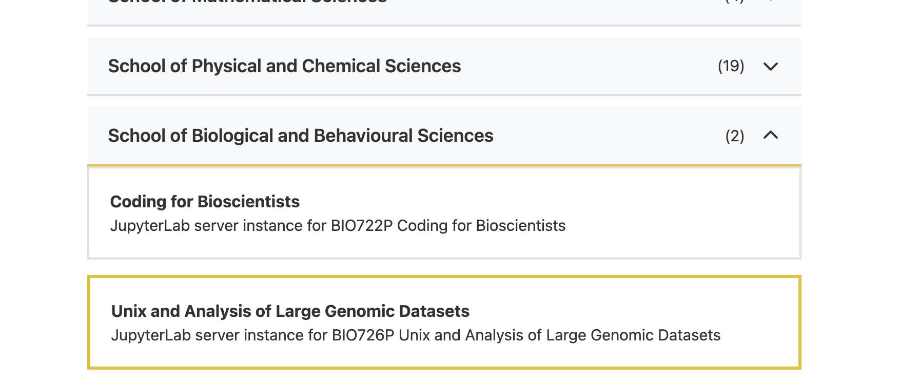

# Part 6: Using the Teaching Cluster

------------------------

This practical introduces the QMUL Teaching Cluster and uses it to run some structural variant analysis using **Nanopore data** from ***Plasmodium falciparum***. The focus is not just on running a few commands, but on understanding how to set up a fresh compute environment, install software reproducibly, organise a project, and automate your analysis with some bash scripting!

Before starting this practical, you should have finished all prior practicals!

------------------------

# 1. Overview and Aims

By the end of this practical, you should be able to:

1. Access and use the Teaching Cluster through your web browser.
2. Understand what Conda environments are and why they are useful.
3. Install bioinformatics software from `conda-forge` and `bioconda`.
4. Source and download reference and sequencing data using the command line.
5. Run a structural variant analysis workflow.
6. Create you workflow as a reusable bash script.

------------------------

# 2. Accessing the Teaching Cluster

The Teaching Cluster provides a remote Linux environment that you can access through your browser. It is a JupyterHub-based system, which means each user launches their own Jupyter server. By default, this opens as a JupyterLab session, but from there you can also open other tools and work across multiple tabs. Each server type provides access to a defined set of shared compute resources. For this practical, you should use **BIO726P - Unix & Analysis Of Large Genomic Datasets**, image. 

!!! Task
    Go to [https://hub.comp-teach.qmul.ac.uk/](https://hub.comp-teach.qmul.ac.uk/) and log in with your QMUL account.

    Use your QMUL username only, for example `abc123`.
    Do **not** add `@qmul.ac.uk`.


!!! Task
    Once, logged in you will be taken to a page where you can select the instance you would like to use. For this scroll down to the bottom on the page and select the tab **Project Work**. This will provide several options, however you should select the option **Unix and Analysis of Large Genomic Datasets** image. Once you have clicked on this option, scroll down to the bottom of the page and select **start**. 




!!! Task
    Once you have clicked on this option, scroll down to the bottom of the page and select **start**. Wait for the loading screen to finish. Starting server can take few seconds to few minutes (depends on the cluster use). 


!!! Task
    Once you image is up and running you will be presented the standard Jupyter Lab interface with Launcher open as shown in the next screenshot below:


!!! Info
    Before opening the terminal, take a moment to understand the layout of the JupyterLab screen:

    * Across the **top** is the menu bar, where you can access options such as `File`, `Edit`, `View`, `Run`, and `Settings`.
    * On the **left-hand side** is the file browser. This is where you can navigate through your folders and files on the Teaching Cluster. In the screenshot, you can already see directories such as `Archive` and `docs`.
    * The **middle of the screen** is the main working area. Right now it is showing the **Launcher**, which gives you shortcuts to open tools such as a Notebook, Terminal, Text File, Markdown File, Python file, RStudio, Desktop, or VS Code.
    * Along the **top of the main panel** you will also see tabs. As you open files, terminals, or notebooks, each one appears as a new tab in this area.
    * The small icons in the **far left sidebar** give quick access to tools such as the file browser, running sessions, table of contents, or extensions.

    In this practical, the parts you will use most are the **file browser on the left** and the **terminal launcher tile in the centre**.

!!! Task
    Click on the **terminal icon** to open the terminal.  


------------------------

# 3. Creating your project directory

As in the previous practicals, start by making a well-organised working directory.

!!! Task
    Create a main directory for today's session, together with subdirectories for input data, reference files, intermediate files, final results, and your command log.

    For example:

    ```
    mkdir BIO726P_Teaching_Cluster
    cd BIO726P_Teaching_Cluster
    mkdir input references tmp results
    touch WHATIDID.txt
    ```

Your directory structure should look like this:

!!! terminal
    ```
    BIO726P_Teaching_Cluster
    ├── input
    ├── references
    ├── results
    ├── tmp
    └── WHATIDID.txt
    ```

------------------------

# 4. Software environments with Conda

The Teaching Cluster image used for this practical already contains the software needed
for the structural variant analysis, including `NanoPlot`, `chopper`, `minimap2`,
`samtools`, and `Sniffles`. These programs are installed in Conda's `base` environment,
which is active by default when you open a terminal, so they can be used immediately.

However, it is still important to understand how software environments are managed in bioinformatics. Different projects may require different versions of the same program, or programs with conflicting dependencies. Conda provides one way to create and manage these isolated environments.

## 4.1 Why use Conda?

Conda is a package and environment manager. It can be used to:

- install software without requiring administrator access;
- create isolated environments containing specific software versions;
- keep the dependencies for different projects separate;
- reproduce a software environment on another system;
- document which software was used in an analysis.

In bioinformatics, you will commonly encounter the `conda-forge` and `bioconda` channels.

- `conda-forge` provides a large collection of general scientific and computational software.
- `bioconda` provides many bioinformatics packages.

!!! Info
    A **Conda channel** is a repository from which Conda obtains packages.

    An **environment** is an isolated collection of software packages and their dependencies. Activating an environment changes which versions of programs are available to your shell.


---

## 4.2 Inspecting the existing software

First, confirm which executable and version are available in the supplied environment.

!!! Task
    Check where the main SV-analysis programs are located:

    ```
    which NanoPlot
    which chopper
    which minimap2
    which samtools
    which sniffles
    ```

    You should see something like:

    ```
    /opt/conda/bin/NanoPlot
    ```

    Now check their versions:

    ```
    NanoPlot --version
    chopper --help
    minimap2 --version
    samtools --version
    sniffles --version
    ```

!!! Question

    === "Question"

        Why might it still be useful to know the exact version of each program even though the software is already installed?

    === "Answer"

        It helps with reproducibility, interpreting results, troubleshooting, and comparing analyses performed on different systems.

---

## 4.3 Exploring Conda

Conda is also available on the Teaching Cluster. Use it to confirm which environment is
active and where that environment is located.

!!! Task
    Check that Conda is available:

    ```
    conda --help
    ```

    Now inspect the environments that already exist:

    ```
    conda env list
    ```

    You should see something like the following.

    ```
    # conda environments:
    #
    # * -> active
    # + -> frozen
    base                 *   /opt/conda
    ```

    The `*` marks `base` as active, and `/opt/conda` is its location. Conda adds the
    active environment's `bin` directory to your `PATH`, which is why the programs in
    Section 4.2 can be run by name. In the next section, you will create a separate
    environment for demonstrating project-specific packages and versions.

------------------------

# 5. Creating a small Conda environment

You will now create a separate Conda environment to demonstrate how software environments can be built and isolated.

**This environment is for learning about Conda. You do not need to use it for the main SV analysis in this practical.**

!!! Task
    For example lets assume on the Teaching Cluster we want run a SNP identification pipeline, for this we will need the [BowTie2 aligner - link] (https://anaconda.org/channels/bioconda/packages/bowtie2/overview) and [bcftools - link](https://anaconda.org/channels/bioconda/packages/bcftools/overview). To install these packages in a fresh environment you can use the following command! Review each component to ensure you understand what is going on! (To do this you can use `conda --help` and `conda create --help`).

    ```
    conda create -n SNP_Pipeline -c conda-forge -c bioconda bowtie2 bcftools -y
    ```

    Activate it:

    ```
    conda activate SNP_Pipeline
    ```

    Check that the programs are available:

    ```
    which bowtie2
    which bcftools
    ```


!!! Question

    === "Question"

        What has changed compared with the tools you inspected before activating `SNP_Pipeline`?

    === "Answer"

        The location of the executable changes, and the version of the software may differ depending on the environment. Activating a Conda environment changes which software your shell uses.

        For example, minimap2 which is installed in the base environment is at:

        ```
        which minimap2
        /opt/conda/bin/minimap2
        ```

        Compared to bowtie2, which is installed in the SNP_Pipeline enviornment:

        ```
        /home/jovyan/.conda/envs/SNP_Pipeline/bin/bowtie2
        ```

---


## 5.2 Exporting an environment

Once an environment has been created, its configuration can be recorded.

!!! Task
    Export your environment:

    ```
    conda env export > SNP_Pipeline.yml
    ```

    Inspect the resulting file:

    ```
    head SNP_Pipeline.yml
    ```

    The YAML file records information about the environment, including its packages and versions. This should look something like:

    ```
    name: SNP_Pipeline
    channels:
    - conda-forge
    - bioconda
    dependencies:
    - _openmp_mutex=4.5=20_gnu
    - bcftools=1.24=h118bc1c_2
    - bowtie2=2.5.5=h63e9258_1
    - bzip2=1.0.8=hda65f42_10
    - c-ares=1.34.8=hebe6cf0_2
    ```

!!! Question

    === "Question"

        How could this file help someone else reproduce your analysis?

    === "Answer"

        It provides a reproducible specification of the exact software stack used, which allows another person or a future workflow to recreate the same environment on a different machine.

---

## 5.3 Deactivating the environment


!!! Task

    **Important** - When you are finished exploring and using the environment remember to deactivate it! We wont need these tools in the following session for structural variant analysis. 

    ```
    conda deactivate -n SNP_Pipeline
    ```

!!! Info
    Conda is **not simply an alternative way of finding programs that are missing**.

    It is a way of controlling the software environment in which an analysis is performed.

    In a real research project, you might encounter a situation where:

    - the system already provides most of the software you need;
    - one project requires a particular version of a tool;
    - two projects require incompatible versions;
    - a collaborator gives you an environment specification;
    - you need to reproduce an analysis months or years later.

    Conda can help address these situations.

------------------------

# 6. Now Back To Our Structural Variant Analysis!

We now need a reference genome for *Plasmodium falciparum* 3D7. To source this we can turn to the NCBI genome database [link here!](https://www.ncbi.nlm.nih.gov/datasets/genome/?taxon=36329). Select the reference genome assembly **(GCA_000002765)** and subsequently navigate to the **FTP site** [link here](https://ftp.ncbi.nlm.nih.gov/genomes/all/GCF/000/002/765/GCF_000002765.6_GCA_000002765/). Look across the files available, do any formats look familiar? 

!!! Task
    Now it is time to download the reference genome. 


    ```
    cd ~/BIO726P_Teaching_Cluster/references
    wget https://ftp.ncbi.nlm.nih.gov/genomes/all/GCF/000/002/765/GCF_000002765.6_GCA_000002765/GCF_000002765.6_GCA_000002765_genomic.fna.gz
    ```

    Decompress the FASTA file:

    ```
    gunzip GCF_000002765.6_GCA_000002765_genomic.fna.gz
    ```

    Inspect the FASTA file, does it match what you expect? 

    ```
    ls -lh
    grep "^>" GCF_000002765.6_GCA_000002765_genomic.fna | head
    ```


------------------------

# 7. Downloading Our Nanopore Data


!!! Task 
    Now it is time to download the *Plasmodium falciparum* sequencing data for **3 samples** which you will be analysing in this assessment. The dataset is available on your AWS Instances and as such you must transfer it to the teaching cluster. To achieve this we will be using **RSync** (remote synchronisation). This is a command-line tool for copying and synchronising files between locations, including between your AWS instance and the teaching cluster. It compares the source and destination, transferring only new or changed files rather than copying everything each time

    1) First ensure your AWS Instances are switched on by going to  [https://switch.genomicscourse.com/](https://switch.genomicscourse.com/)


    2) Navigate into your input data sub-directory and subsequently run the Rsync Command. **Remember to change matt to your username!** 

    ```
    cd ~/BIO726P_Teaching_Cluster/input/
    rsync -avzP matt@matt.genomicscourse.com:'/shared/data/Pf_*.fastq.gz' ./ 
    ```
    
    3) Check the file exists and inspect the first read:

    ```
    ls -lh Pf_Sample_A.fastq.gz
    zcat Pf_Sample_A.fastq.gz | head -n 4
    ```


!!! Question

    === "Question"

        Looking at the rsync manual (`man rsync`) can you identify what the parameters `-avzP` were doing?

    === "Answer"
        **-a (archive)**: Preserves file permissions, modification times, and symlinks.
        **-v (verbose)**: Displays transfer details in the console.
        **-z (compress)**: Compresses data during transit to speed up the download.
        **-P (progress/partial)**: Shows a real-time progress bar and retains partially downloaded files if the connection drops.


!!! Question

    === "Question"

        Thinking back to the practical session on Day, what are the four lines that make up one FASTQ record?

    === "Answer"

        A FASTQ record contains:
            - 1) A read header line beginning with `@`, 
            - 2) The nucleotide sequence, 
            - 3) A separator line usually containing `+`,
            - 4) A quality string with one character per base.


!!! Info 

    **BACK UP - Please follow this method for obtaining the sequencing data if you were not able to use RSync.** 

    If you were unable to use RSync, please let a demonstrator know. In the mean time you can source the data via QMPLus. Please identitfy the 'Plasmodium_falciparum_Sample_Data' folder and then select the `download folder` button as shown below. 

    

    Next **upload the data to the Teaching Cluster** using the upload button as shown in the image below: 

    

    Finally move the uploaded data into your `input` directory:

    ```
    mv Pf*.fastq.gz  ~/BIO726P_Teaching_Cluster/input

    ```


------------------------

# 8. Part 1: Exploring the structural variant workflow step-by-step

In this first part, you will run each command manually so that you understand what every step is doing.

## 8.1 Quality control of the raw reads

!!! Task
    Change into your `tmp` directory and run NanoPlot on the raw FASTQ file:

    ```
    cd ~/BIO726P_Teaching_Cluster/tmp
    NanoPlot --fastq ../input/Pf_Sample_A.fastq.gz --outdir Pf_Sample_A_nanoplot_raw
    ```

    Did you encounter an **error message** like below?

    ```
    If you read this then NanoPlot 1.48.0 has crashed :-(
    Please try updating NanoPlot and see if that helps...

    If not, please report this issue at https://github.com/wdecoster/NanoPlot/issues
    If you could include the log file that would be really helpful.
    Thanks!


    Traceback (most recent call last):
    File "/opt/conda/bin/NanoPlot", line 10, in <module>
        sys.exit(main())
                ^^^^^^
    File "/opt/conda/lib/python3.12/site-packages/nanoplot/NanoPlot.py", line 111, in main
        plots = make_plots(datadf, settings)
                ^^^^^^^^^^^^^^^^^^^^^^^^^^^^
    File "/opt/conda/lib/python3.12/site-packages/nanoplot/NanoPlot.py", line 190, in make_plots
        nanoplotter.scatter(
    File "/opt/conda/lib/python3.12/site-packages/nanoplotter/nanoplotter_main.py", line 161, in scatter
        fig = ff.create_2d_density(
            ^^^^^^^^^^^^^^^^^^^^
    AttributeError: module 'plotly.figure_factory' has no attribute 'create_2d_density'
    ```

    First thing we can do is see if anyone else has encountered the same issue by searching online. Most people log issues via Github reports and it appears someone hit the same issue [Link Here](https://github.com/wdecoster/NanoPlot/issues/442.) From reading this thread, it appears we have hit a dependancy issue within our environment specifically regarding the Plotly package depedancy  

    Right lets see what version of Plotly we are using: 

    ```
    pip show plotly
    ```

    We can see that we have plotly version 7.0.0 install which is causing the issue. To fix and practice creating a new enviornment at the same time lets, reinstall nanoplot with the correct version (6.9.0) of the [(Plotly Package)](https://anaconda.org/channels/conda-forge/packages/plotly/overview): 

    ```
    conda create -n NANOPLOT_FIX -c conda-forge -c bioconda plotly==6.9.0 nanoplot=1.48 -y
    ```

    Now lets activate our environment, double check we have the correct versionof plotly installed (6.9.0) and retry our command 

    ```
    conda activate NANOPLOT_FIX

    pip show plotly        

    NanoPlot --fastq ../input/Pf_Sample_A.fastq.gz --outdir Pf_Sample_A_nanoplot_raw
    ```

    This time the command works and we can move forward with the analysis! 


!!! Task
    Inspect the output directory:

    ```
    ls Pf_Sample_A_nanoplot_raw
    ```

    The directory should contain the following files: 

    ```
    ls Pf_Sample_A_nanoplot_raw
    LengthvsQualityScatterPlot_dot.html
    LengthvsQualityScatterPlot_dot.png
    LengthvsQualityScatterPlot_kde.html
    LengthvsQualityScatterPlot_kde.png
    NanoPlot_20260804_0826.log
    NanoPlot-report.html
    NanoStats.txt
    Non_weightedHistogramReadlength.html
    Non_weightedHistogramReadlength.png
    Non_weightedLogTransformed_HistogramReadlength.html
    Non_weightedLogTransformed_HistogramReadlength.png
    WeightedHistogramReadlength.html
    WeightedHistogramReadlength.png
    WeightedLogTransformed_HistogramReadlength.html
    WeightedLogTransformed_HistogramReadlength.png
    Yield_By_Length.html
    Yield_By_Length.png

    ```

    Using the left-side bar, navigate to the directory and open the `NanoPlot-report.html`. 
    


!!! Info
    **IMPORTANT NOTE** - To view all the figures in the .html report you may have to click the Trust HTML button on top left side of the window. 
    


!!! Task 

    Inspect the report to gauge the underlying quality of the nanopore sequencing data!

!!! Question

    === "Question"

        What kinds of features is NanoPlot useful for checking before alignment?

    === "Answer"

        It helps you inspect read-length distributions, quality-score distributions, total yield, and whether the dataset contains many short or low-quality reads.
    

## 8.2 Filter the reads

For many analyses, it is helpful to remove very short or very low-quality reads before alignment.

!!! Task
    Filter the reads using `chopper` and save the result as a gzipped FASTQ file.

    For this first round of filtering, use:

    * a minimum quality score of `10`
    * a minimum read length of `1000` bp

    Use `chopper -h` to work out which options you need. Then think back to previous practicals: if your input is compressed and you want the final output to stay compressed, what should your command pipeline include?

!!! Question

    === "Question"

        What `chopper` command would you use?

    === "Answer"

        ```
        zcat ../input/Pf_Sample_A.fastq.gz | chopper -q 10 -l 1000 | gzip > Pf_Sample_A_filtered_reads.fastq.gz
        ```

!!! Question

    === "Question"

        How many reads remained after filtering Pf_Sample_A?

    === "Answer"

        Kept 32939 reads out of 34084 reads


!!! Info
    Here, `-q 10` removes very low-quality reads and `-l 1000` keeps only reads that are at least 1000 bases long. The `zcat ... | ... | gzip` pattern decompresses the input on the fly and writes the filtered output back out as a compressed FASTQ file.

!!! Task
    Run NanoPlot again on the filtered reads. Inspect the output report, can you confirm that the filtering implemented by chopper was successful? 

    ```
    NanoPlot --fastq Pf_Sample_A_filtered_reads.fastq.gz --outdir Pf_Sample_A_nanoplot_filtered
    ```

!!! Question

    === "Question"

        Why might filtering improve downstream structural variant calling?

    === "Answer"

        Very short or poor-quality reads can map less reliably and may increase false-positive variant calls. Filtering can improve mapping quality and reduce noise.


!!! Question

    === "Question"

        What other metrics does Chopper allow you to filter on and when would you implement these? 

    === "Answer"

        In addition to minimum quality (`-q`) and minimum length (`-l`), `chopper` can filter on maximum quality (`--maxqual`), maximum read length (`--maxlength`), minimum and maximum GC content (`--mingc`, `--maxgc`), and contaminant sequence matching using a FASTA file (`--contam`).


## 8.3 Map reads to the reference

We will now align the filtered reads to the reference genome using `minimap2`.

!!! Task
    Run the alignment and write the output to SAM format:

    ```
    minimap2 -ax map-ont -t 4 ../references/GCF_000002765.6_GCA_000002765_genomic.fna Pf_Sample_A_filtered_reads.fastq.gz -o Pf_Sample_A.sam
    ```

!!! Info
    The `-ax map-ont` preset is designed for Oxford Nanopore reads. Using the `-h` sub-command, see what the `-t` parameter is used for!


!!! Task
    Convert the SAM file to a sorted BAM file and index it:

    ```
    samtools sort -O BAM Pf_Sample_A.sam > Pf_Sample_A.sorted.bam
    samtools index Pf_Sample_A.sorted.bam
    ```

!!! Task
    Generate a few simple alignment statistics:

    ```
    samtools flagstat Pf_Sample_A.sorted.bam
    samtools idxstats Pf_Sample_A.sorted.bam| head
    ```

!!! Question

    === "Question"

        How could you redirect the stdout of these commands to a file? 

    === "Answer"

        ```
        samtools flagstat Pf_Sample_A.sorted.bam > Pf_Sample_A.stats
        ```

!!! Question

    === "Question"

        Why do we usually work with sorted and indexed BAM files rather than raw SAM files?

    === "Answer"

        BAM files are compressed and therefore smaller than SAM files. Sorting and indexing also make downstream analyses faster because tools can efficiently access alignments by genomic position.

## 8.4 Call structural variants with Sniffles

!!! Task
    Run Sniffles on the sorted BAM file:

    ```
    sniffles --input Pf_Sample_A.sorted.bam --vcf Pf_Sample_A.sniffles.vcf
    ```

!!! Task
    Inspect the first few lines of the VCF:

    ```
    head Pf_Sample_A.sniffles.vcf
    ```


!!! Question

    === "Question"

        How many variants were called?

    === "Answer"

        Only a single deletion was identified:

        ```
        grep -vc "^#" Pf_Sample_A.sniffles.vcf
        ```


!!! Question

    === "Question"

        What is the difference between the header lines and the variant lines in a VCF file?

    === "Answer"

        Header lines begin with `#` and describe the file format, metadata, and column names. Variant lines contain the actual variant records.

------------------------

# 9. Interpreting the structural variants

Now that you have a structural variant call set, start thinking about biological interpretation.

For this dataset, Sniffles reported exactly one structural variant in `Pf_Sample_A.sniffles.vcf`.

!!! Task
    Confirm how many variant records are present (non-header lines):

    ```
    grep -vc "^#" Pf_Sample_A.sniffles.vcf
    ```

    Then print the variant record itself:

    ```
    grep -v "^#" Pf_Sample_A.sniffles.vcf
    ```

!!! Info
    Your output should contain one line similar to:

    ```
    NC_004331.3 2840727 Sniffles2.DEL.12SA N <DEL> 60 PASS PRECISE;SVTYPE=DEL;SVLEN=-975;END=2841702;SUPPORT=20;...;VAF=1.000 GT:GQ:DR:DV:PS 1/1:55:0:20:.
    ```

    This line tells us:

    * `SVTYPE=DEL`: the event is a deletion.
    * `CHROM=NC_004331.3`, `POS=2840727`, `END=2841702`: the deleted interval is on chromosome NC_004331.3 from 2,840,727 to 2,841,702.
    * `SVLEN=-975`: deletion length is 975 bp (negative sign indicates deletion).
    * `FILTER=PASS`: the call passed Sniffles filtering.
    * `QUAL=60`: high confidence score.
    * `SUPPORT=20`: 20 reads support the variant.
    * `VAF=1.000`: all informative reads support the variant allele.
    * `GT=1/1`, `DR=0`, `DV=20`: genotype is homozygous alternate in this sample, with 0 reference reads and 20 variant reads.


!!! Question

    === "Question"

        Based on this VCF, what is the main structural variant call in Pf_Sample_A?

    === "Answer"

        A single, high-confidence 975 bp deletion on chromosome `NC_004331.3` from 2,840,727 to 2,841,702.

        The call is supported by 20 reads, has `FILTER=PASS`, and is genotyped as `1/1` (homozygous alternate) in this sample.


!!! Question

    === "Question"

        Why is it not enough to simply observe that Sniffles reported a deletion?

    === "Answer"

        Variant callers make predictions from read evidence, but those predictions still need interpretation.

        You should evaluate read support, breakpoint precision, coverage context, and whether the event overlaps biologically meaningful features such as genes.

!!! Question

    === "Question"

        What extra information would help you decide whether this deletion is likely to be real?

    === "Answer"

        Useful evidence includes consistent support in replicate samples, local inspection in a genome browser (for split-read and mapping pattern checks), read depth changes around the event, and whether the region is repetitive or difficult to map.


!!! Task

    If you have access to a GFF/GTF annotation file, you can test whether this structural variant overlaps genes of interest.

    As in Section 6, check the NCBI assembly page for the reference used in this practical:
    https://ftp.ncbi.nlm.nih.gov/genomes/all/GCF/000/002/765/GCF_000002765.6_GCA_000002765/

    If a GFF file is available, download it with `wget`.

    Then run a simple coordinate-overlap check with `awk`:

    ```
    awk -F'\t' '$1=="CONTIG_NAME" && $4<=START_POS && $5>=END_POS' Pf3D7_annotation.gff | head

    # Example

    awk -F'\t' '$1=="NC_004331.3" && $4<=2841000 && $5>=2840727' Pf3D7_annotation.gff | head
    ```


------------------------

# 10. Part 2: Turning the workflow into a bash script

Running commands manually is useful for learning, but it does not scale well. A script makes your workflow easier to rerun, easier to share, and easier to adapt when you want to analyse another sample or repeat the same workflow later.

In practice, a script does two important jobs:

* it records the exact commands you used, so you do not need to rely on memory or terminal history,
* it keeps repeated setup steps, file paths, and output names in one place, which reduces mistakes when you rerun the analysis.

You have already run the full workflow manually for `Pf_Sample_A.fastq.gz`.

Now the goal is to automate the same analysis for `Pf_Sample_B.fastq.gz` and `Pf_Sample_C.fastq.gz`.

The first version of the script below automates only the early preprocessing steps (QC and filtering) for both samples. That is deliberate: it lets you confirm your file paths, loop logic, and environment before adding mapping and variant calling.

## 10.1 Create your first analysis script

!!! Task
    Return to your main project directory and create a script called `run_sv_analysis.sh`:

    ```
    cd ~/BIO726P_Teaching_Cluster
    nano run_sv_analysis.sh
    ```

    Add the following script:

    ```
    #!/usr/bin/env bash
    set -euo pipefail

    PROJECT_DIR="$HOME/BIO726P_Teaching_Cluster"
    INPUT_DIR="$PROJECT_DIR/input"
    REFERENCE="$PROJECT_DIR/references/GCF_000002765.6_GCA_000002765_genomic.fna"
    TMP_DIR="$PROJECT_DIR/tmp/"
    RESULTS_DIR="$PROJECT_DIR/results"
    SAMPLES=("Pf_Sample_B" "Pf_Sample_C")

    mkdir -p "$TMP_DIR" "$RESULTS_DIR"

    for SAMPLE in "${SAMPLES[@]}"; do
        INPUT_FASTQ="$INPUT_DIR/${SAMPLE}.fastq.gz"
        SAMPLE_TMP_DIR="$TMP_DIR/${SAMPLE}"

        mkdir -p "$SAMPLE_TMP_DIR"

        NanoPlot --fastq "$INPUT_FASTQ" --outdir "$SAMPLE_TMP_DIR/nanoplot_raw"

        zcat "$INPUT_FASTQ" | chopper -q 10 -l 1000 | gzip > "$SAMPLE_TMP_DIR/${SAMPLE}.filtered.fastq.gz"

        NanoPlot --fastq "$SAMPLE_TMP_DIR/${SAMPLE}.filtered.fastq.gz" --outdir "$SAMPLE_TMP_DIR/nanoplot_filtered"
    done
    ```

!!! Info
    At the top of the script you will see:

    ```
    #!/usr/bin/env bash
    set -euo pipefail
    ```

    These lines make the script safer and more reproducible:

    * `#!/usr/bin/env bash` is the **shebang**. It tells the system to run this file using `bash`.
    * `set -e` makes the script stop immediately if a command fails.
    * `set -u` treats use of an undefined variable as an error.
    * `set -o pipefail` makes a pipeline fail if any command in that pipeline fails (not just the last one).

    Together, these settings help you catch mistakes early instead of silently producing incomplete or misleading output.

!!! Task
    Inspect the commands in this file. What steps of your analysis pipeline is it running, and which pieces are still left out?

    The variable names at the top make the script easier to read and update:

    * `PROJECT_DIR` stores the main project path in one place.
    * `INPUT_DIR` and `REFERENCE` point to the data files used by the workflow.
    * `TMP_DIR` and `RESULTS_DIR` separate temporary working files from final outputs.
    * `SAMPLES` defines which samples are processed, so you can scale the workflow by editing one line.

    The loop then runs two early-stage checks for each sample:

    * `NanoPlot` on the original FASTQ file for an initial quality-control summary,
    * `chopper` to filter out short or low-quality reads,
    * `NanoPlot` again on the filtered reads so you can see how the dataset changed after filtering.

    In other words, this version covers preprocessing and quality control for `Pf_Sample_B` and `Pf_Sample_C`, but it does not yet map reads or call structural variants.

    Save the file, then make it executable and run it once to see the intermediate output:

    ```
    chmod +x run_sv_analysis.sh
    ./run_sv_analysis.sh
    ```

!!! Question

    === "Question"

        Now extend the script so it also carries out the mapping, sorting, indexing, and structural variant calling steps for both samples. What would the full version look like?

    === "Answer"

        ```
        #!/usr/bin/env bash
        set -euo pipefail

        PROJECT_DIR="$HOME/BIO726P_Teaching_Cluster"
        INPUT_DIR="$PROJECT_DIR/input"
        REFERENCE="$PROJECT_DIR/references/GCF_000002765.6_GCA_000002765_genomic.fna"
        TMP_DIR="$PROJECT_DIR/tmp/"
        RESULTS_DIR="$PROJECT_DIR/results"
        SAMPLES=("Pf_Sample_B" "Pf_Sample_C")

        mkdir -p "$TMP_DIR" "$RESULTS_DIR"

        for SAMPLE in "${SAMPLES[@]}"; do
            INPUT_FASTQ="$INPUT_DIR/${SAMPLE}.fastq.gz"
            SAMPLE_TMP_DIR="$TMP_DIR/${SAMPLE}"

            mkdir -p "$SAMPLE_TMP_DIR"

            NanoPlot --fastq "$INPUT_FASTQ" --outdir "$SAMPLE_TMP_DIR/nanoplot_raw"

            zcat "$INPUT_FASTQ" | chopper -q 10 -l 1000 | gzip > "$SAMPLE_TMP_DIR/${SAMPLE}.filtered.fastq.gz"

            NanoPlot --fastq "$SAMPLE_TMP_DIR/${SAMPLE}.filtered.fastq.gz" --outdir "$SAMPLE_TMP_DIR/nanoplot_filtered"

            minimap2 -ax map-ont -t 4 "$REFERENCE" "$SAMPLE_TMP_DIR/${SAMPLE}.filtered.fastq.gz" > "$SAMPLE_TMP_DIR/${SAMPLE}.sam"

            samtools sort -O BAM "$SAMPLE_TMP_DIR/${SAMPLE}.sam" > "$SAMPLE_TMP_DIR/${SAMPLE}.sorted.bam"
            samtools index "$SAMPLE_TMP_DIR/${SAMPLE}.sorted.bam"

            samtools flagstat "$SAMPLE_TMP_DIR/${SAMPLE}.sorted.bam" > "$RESULTS_DIR/${SAMPLE}.flagstat.txt"

            sniffles --input "$SAMPLE_TMP_DIR/${SAMPLE}.sorted.bam" --vcf "$RESULTS_DIR/${SAMPLE}.sniffles.vcf"
        done
        ```


## 10.2 Comparing SV across Samples A, B & C


!!! Task 

    Inspect the structural variants identified across samples A, B, and C.

    Are any of the deletions similar between samples? Do any of them affect the same genes? If so, what biological phenotype might you expect?


!!! Question

    === "Question"

        Click here for answers to Task 10.2

    === "Answer"

        Comparing the three samples suggests the following pattern:

        * `Pf_Sample_A` contains a deletion affecting **histidine-rich protein III** (`hrp3`, `PF3D7_1372200`) on `NC_004331.3`.
        * `Pf_Sample_C` contains deletions affecting both **histidine-rich protein II** (`hrp2`, `PF3D7_0831800`) on `NC_004329.3` and **histidine-rich protein III** (`hrp3`, `PF3D7_1372200`) on `NC_004331.3`.
        * `Pf_Sample_B` does not show either of these deletions and can be treated as the comparison sample here.

        So, yes: some of the deletions are similar across samples because both `Pf_Sample_A` and `Pf_Sample_C` show loss of `hrp3`.

        The two relevant deleted regions are:

        * `NC_004329.3:1374236-1375299` overlapping **histidine-rich protein II** (`PF3D7_0831800`)
        * `NC_004331.3:2840727-2841703` overlapping **histidine-rich protein III** (`PF3D7_1372200`)

        A likely biological and clinical consequence is altered performance of **HRP2-based malaria rapid diagnostic tests (RDTs)**.

        Parasites with an `hrp2` deletion, especially when `hrp3` is also deleted, may be more difficult to detect with HRP2-based RDTs and can sometimes produce **false-negative diagnostic results**.

        In this comparison, `Pf_Sample_C` would be the sample of greatest concern for that phenotype because it lacks both `hrp2` and `hrp3`, whereas `Pf_Sample_A` only shows the `hrp3` deletion.


------------------------

# 11. Troubleshooting and dependency issues 

Unlike earlier, conda environments do not always solve perfectly on the first attempt, especially if package versions are constrained. 

This matters when you want to return to the same project for a second analysis pass, because later tools may need a different software stack from the one used for the main SV workflow. A common example is `medaka`, which is often used for polishing and can require a different Python version from the environment you created for NanoPlot, minimap2, samtools, and Sniffles.

!!! Task 
    To demonstrate a package conflict try to install medaka using the command below in your `sv_nanopore` environment.  

    ```
    conda install -c bioconda medaka
    ```

    This may take 1-2 minutes as conda tries to resolve the necessary dependancies. However eventually you should get an error like this:

    ```
    conda install -c bioconda medaka
        Channels:
        - bioconda
        - conda-forge
        Platform: linux-64
        Collecting package metadata (repodata.json): done
        Solving environment: failed

        LibMambaUnsatisfiableError: Encountered problems while solving:
        - nothing provides tensorflow 1.12.0 needed by medaka-0.5.2-py36h2b5150b_0

        Could not solve for environment specs
        The following packages are incompatible
        ├─ medaka =* * is installable with the potential options
        │  ├─ medaka [0.10.0|0.10.1|...|1.2.2] would require
        │  │  └─ python >=3.6,<3.7.0a0 *, which can be installed;
        │  ├─ medaka [0.5.2|0.6.0|...|0.7.0] would require
        │  │  └─ tensorflow ==1.12.0 *, which does not exist (perhaps a missing channel);
        │  ├─ medaka [1.1.1|1.1.2|...|1.2.2] would require
        │  │  └─ python >=3.7,<3.8.0a0 *, which can be installed;
        │  ├─ medaka [1.1.1|1.1.2|...|2.1.0] would require
        │  │  └─ python >=3.8,<3.9.0a0 *, which can be installed;
        │  ├─ medaka [1.10.0|1.11.0|...|2.2.1] would require
        │  │  └─ python >=3.10,<3.11.0a0 *, which can be installed;
        │  ├─ medaka [1.10.0|1.11.0|...|2.1.1] would require
        │  │  └─ python >=3.9,<3.10.0a0 *, which can be installed;
        │  ├─ medaka [1.2.3|1.2.5|...|1.6.1] would require
        │  │  └─ tensorflow =2.2 *, which does not exist (perhaps a missing channel);
        │  ├─ medaka [2.0.0|2.0.1|2.1.1|2.2.0|2.2.1] would require
        │  │  └─ python >=3.11,<3.12.0a0 *, which can be installed;
        │  └─ medaka [2.1.1|2.2.0|2.2.1|2.2.2] would require
        │     └─ python >=3.12,<3.13.0a0 *, which can be installed;
        └─ pin on python =3.13 * is not installable because it requires
        └─ python =3.13 *, which conflicts with any installable versions previously reported.

        Pins seem to be involved in the conflict. Currently pinned specs:
        - python=3.13
    ```

!!! Question

    === "Question"

        Based on the error message obtained what is the main problem?

    === "Answer"

        The main problem is a Python version pin conflict. The environment is pinned to `python=3.13`, but the available `medaka` builds require older Python versions and specific TensorFlow dependencies, so Conda cannot find a compatible set of packages.

        In practice, the fix is usually to keep the structural-variant workflow environment unchanged and create a separate environment for the follow-up tool rather than forcing everything into one install.

        **Follow the steps outlined previously and create a new conda environment with `medaka` installed!**


!!! Question

    === "Question"

        If Conda reports a dependency conflict, what are some sensible next steps?

    === "Answer"

        You can try creating a fresh environment, changing the package version, changing channel priority, installing fewer packages at once, or using `mamba` to obtain a clearer solver result.


!!! Info
    A good long-term habit is to export your environment once it works, especially if you want to move the analysis to another machine or recreate it later.

    This creates a record of the software versions used in the analysis:

    ```
    conda env export > sv_nanopore_environment.yml
    ```

    You can then use this file as a reference when rebuilding the environment elsewhere.

------------------------

# 12. Summary

In this practical you have:

* accessed a remote Linux environment,
* created a structured project directory,
* installed software with Conda,
* downloaded a reference genome and Nanopore data,
* run a structural variant workflow step by step,
* converted that workflow into a reusable bash script.

These are core skills that transfer directly to larger bioinformatics projects on HPC / cloud systems.

------------------------

# 13. Extension Questions & Tasks

!!! Task 

    **Bonus**

    Try to source additional nanopore sequencing data for *Plasmodium falciparum*  from NCBI SRA (https://www.ncbi.nlm.nih.gov/sra) and analyse this! For example take a look at the sample (ERX15224754)

!!! Task 

    **Bonus**
    
    Can you find any bioinformatics software which is good at visualising structural variants and available in Conda? If so try download it and take a look at the SV identified via your sniffles analysis!   